# מפת משפך שאלון ה‑DNA החינמי → CRM, אימיילים ורכישת המאגר

**עודכן:** 24 בספטמבר 2026  
**היקף:** מיפוי מהקמפיין/עמוד הנחיתה, דרך שאלון ה‑DNA החינמי, יצירת ליד ב־CRM, סדרת אימיילים, רישום ותשלום Grow, ועד הפעלת הפרופיל במאגר. הבדיקה מבוססת על קוד הפרויקט, תיעוד הדשבורד, קבצי ביצועים מתועדים ואימות HTTP של הנתיבים הציבוריים. אין בדוח פרטי לקוחות.

## מסקנה

המשפך בנוי כמודל **ערך מיידי → זיהוי אישי → הזמנה להצטרפות → תשלום מאומת → השלמת פרופיל**. השאלון החינמי נותן תוצאה אישית של אחד מארבעה טיפוסי DNA, אך דורש שם, אימייל, טלפון והסכמה לדיוור לפני הצגת התוצאה. באותו רגע נוצר או מתעדכן ליד `dna_quiz` ב־CRM, נשמרים נתוני UTM ומזהי Meta אם הגיעו, ונפתח מסע אימייל בן שישה מסרים המותאם למגדר ולטיפוס ה־DNA.

הרכישה אינה נספרת כעסקה על סמך דף תודה או פיקסל בלבד. נקודת האמת העסקית היא webhook של Grow, שרושם תשלום ב־`completed_payments` עם `amount_source = grow`, מעדכן את ליד ה־CRM ל־`client_database`, ושולח אירוע Purchase צד־שרת ל־Meta CAPI. לאחר התשלום הלקוח/ה עדיין אינו/ה פרופיל פעיל/ה להתאמות עד מילוי שאלון מדעי אישי. זהו שלב תפעולי מהותי, לא רק מסר שיווקי.

## קישורים ציבוריים ונתיבים

| שלב | נתיב ציבורי | ייעוד | סטטוס בבדיקה |
|---|---|---|---|
| כניסה לאתר | [hilitcaspi.com](https://hilitcaspi.com/) | דף הבית וקליטת UTM ראשונית | HTTP 200 |
| שאלון חינמי | [DNA Quiz](https://hilitcaspi.com/dna-quiz) | שאלון DNA, לכידת פרטים ותוצאה | HTTP 200 |
| דף מכירת המאגר | [המאגר](https://hilitcaspi.com/database) | הסבר השיטה, ציפיות, CTA להצטרפות | HTTP 200 |
| טופס הצטרפות | [Join](https://hilitcaspi.com/join) | פרופיל, טיוטה ותשלום | HTTP 200 |
| תודה לאחר תשלום | [Thank you](https://hilitcaspi.com/thank-you/database) | איתור עסקה והמשך לשאלון המדעי | HTTP 200 |
| שאלון מדעי לאחר תשלום | [Questionnaire](https://hilitcaspi.com/join/questionnaire) | נגיש רק עם token אישי ותשלום/גישה חינמית תקפים | HTTP 200, אך ללא token אין גישה לתוכן |
| תקנון מאגר | [תקנון](https://hilitcaspi.com/terms/database) | תנאי הצטרפות וביטול | HTTP 200 |
| הסרה מדיוור | [Unsubscribe](https://hilitcaspi.com/unsubscribe) | הסרה שיווקית | HTTP 200 |
| WhatsApp | [wa.me/972552442334](https://wa.me/972552442334) | ערוץ תמיכה ושאלות | ציבורי |

נתיבי הצוות קיימים ב־`/crm`, `/crm/analytics`, `/crm/dashboard` ו־`/crm/emails`, אך אינם קישורים ציבוריים תפעוליים: פעולות הנתונים בשרת מוגנות ב־`teamProcedure` ובבדיקת מנהל/צוות. לכן אין לחשוף אותם בפרסום או להתייחס אליהם כעמודי נחיתה.

## המסלול המלא

```mermaid
flowchart RL
    A[מודעת Meta / אורגני / אימייל\nUTM + מזהי Meta] --> B[דף DNA חינמי\n/dna-quiz]
    B --> C[בחירת מגדר\n20 היגדים + שובר שוויון]
    C --> D[טופס פרטים והסכמה\nשם, אימייל, טלפון]
    D --> E[CRM Lead\nsource=dna_quiz]
    D --> F[DNA result\n4 טיפוסים]
    E --> G[Brevo + email_log\nמסע 6 אימיילים לפי מגדר]
    F --> H[CTA: הצטרפות למאגר\n/join עם DNA ו־UTM]
    G --> H
    H --> I[פרופיל והכנת טיוטה\nתנאים + גיל 18+]
    I --> J[InitiateCheckout\nGrow Wallet]
    J --> K{תשלום Grow מאומת?}
    K -->|לא, 1–2 שעות| L[מסע נטישת עגלה\n3 אימיילים]
    K -->|כן| M[Webhook Grow]
    M --> N[completed_payments\nמקור אמת]
    M --> O[CRM: client_database\n+ פרופיל paid]
    M --> P[Meta CAPI + GA4 Purchase]
    O --> Q[דף תודה / מייל\nקישור אישי לשאלון מדעי]
    Q --> R[שאלון מדעי 15 דקות\nהפעלה למאגר]
    R --> S[מסע Welcome לאחר רכישה\nימים 0,3,7,14]
```

### 1. רכישת תנועה וקליטת שיוך

האתר טוען GA4, Google Tag Manager ושני Meta Pixels בדף הראשי. בעת נחיתה, `ReferrerDetector` שומר `utm_source`, `utm_medium`, `utm_campaign`, `utm_content`, `utm_term`, וכן `meta_campaign_id`, `meta_adset_id`, `meta_ad_id`, `meta_placement` ו־`site_source_name`, גם ב־`sessionStorage` וגם ב־`localStorage`. השמירה המקומית נועדה לשרוד ניווט בתוך האתר ואף חזרה מהדומיין של Grow.

**מסר התנועה:** הבטחת תועלת קצרה ולא מכירת המאגר מיד: “3 דקות כדי להתחיל להבין איזה דפוס זוגי מוביל אותך”, “חינם לגמרי”, “תוצאה אישית מיידית”. ההצדקה היא שאלון המבוסס, לפי נוסח העמוד, על מודלים מפסיכולוגיה זוגית. לצד ההבטחה מופיעה הסתייגות נכונה: התוצאה היא כלי להתבוננות, לא אבחון מקצועי ולא הבטחה לזוגיות.

**נקודות מדידה:** PageView של Meta; page view פנימי; GA4 page view; שימור UTM; Reach, Impressions, CPM, CTR, Frequency ו־Spend ב־Meta.

### 2. שאלון DNA חינמי: ערך, סגמנטציה ולכידת ליד

`/dna-quiz` מתחיל בבחירת מגדר. אחריה יש 20 היגדים בדירוג 1–5 בארבעה ממדים: מנהיג/ה, רומנטיקן/ית, רוח חופשית ועוגן יציב. במקרה של שוויון יש שאלת הכרעה. התוצאה כוללת ציון לכל ממד, “הנכס הזוגי”, “האתגר” ו“סוד ההתאמה”. המענה פונה בלשון מותאמת מגדר.

לפני התוצאה המשתמש/ת נדרש/ת למסור שם מלא, אימייל וטלפון ולאשר קבלת תוצאות ועדכונים במייל. אין מסלול דילוג על הפרטים בגרסת DNA הפעילה. רק לאחר הלכידה נשלחת בקשת `crm.createLead` עם `source = dna_quiz`, מגדר, טיפוס DNA, מזהה סשן, UTM ומזהי Meta; רק לאחר מכן מוגשות תשובות השאלון ונפתחת תוצאת ה־DNA.

**CTA ראשי:** “הצגת התוצאה שלי”.  
**נקודות מדידה:** `dna_quiz_start` בעת בחירת מגדר; `generate_lead` ב־GA4 לאחר יצירת ליד; `dna_quiz_complete` במערכת הפנימית וב־GA4; `Lead` ב־Meta עם `content_name = שאלון DNA - תוצאות`; רשומת `dna_quiz_results`.

**משמעות CRM:** המנגנון מבצע upsert לפי אימייל. ליד קיים מתעדכן בפרטי קשר, DNA וייחוס; ליד חדש נוצר עם סטטוס `new_lead`. לכן ספירת “לידים חדשים” אינה זהה בהכרח למספר השלמות שאלון או למספר submissions, במיוחד למשתמשים חוזרים.

### 3. עמוד התוצאה: שינוי מסגרת מאבחון להצטרפות

המסר בעמוד התוצאה משנה את המוטיבציה מ“להבין את עצמי” ל“למצוא התאמה”. הוא מסביר שהמאגר דיסקרטי, שמור תוצאות האבחון, ושילוב החישוב עם אישור אישי של הילית מחליף “החלקות ימינה ושמאלה”. הוא גם מבהיר שהשלב הבא לאחר הרישום הוא שאלון מדעי ואישיות של כ־15 דקות.

**CTA עיקרי:** “כן! הילית, אני רוצה שתמצאי לי התאמה”. הוא מוביל ל־`/join` ומעביר `dna`, מגדר, מזהה session ופרטי קשר שכבר הוזנו. כך הטופס יכול להיטען מראש ולהקטין חיכוך. יש גם CTA משני לקבוצת WhatsApp שקטה, ואפסייל נפרד לליווי אישי במחיר 2,900 ₪; יש להפריד את האפסייל הזה מהמרת המאגר בדיווח.

**מחיר המוצג במסלול:** דמי רצינות ורישום חד־פעמיים של 299 ₪. נוסחי דפי המכירה והאימיילים מסבירים שאין דמי מנוי חודשיים. ההבהרה התפעולית היא חיונית: התשלום הוא עבור כניסה למאגר ותהליך התאמה מקצועי, לא ליווי אישי ולא התחייבות לכמות או תדירות התאמות.

### 4. דף מכירת המאגר כנתיב חלופי או חימום

`/database` הוא דף מכירה מלא שיכול לקבל תנועה ישירה, וכן מציע DNA חינמי כ־CTA משני. המסר המרכזי: “לא שידוך. לא אפליקציה. משהו אחר לגמרי.” הוא מבסס את ההצעה על שש שכבות התאמה, חישוב + בדיקה אנושית, אישור הדדי וחשיפת פרטים רק אחרי שני אישורים.

הדף שולח `database_view` פנימי, Meta `ViewContent` ו־GA4 `view_item`. שלושת CTA ההצטרפות — navbar, hero וסיום — שולחים `database_cta` עם `placement`, ומייצרים `/join?source=database` תוך שימור UTM, מזהי Meta ופרטי experiment. ה־CTA הנגדי “שאלון DNA חינמי קודם” מחזיר ל־`/dna-quiz`.

### 5. טופס הצטרפות והתחלת תשלום

`/join` אוסף פרופיל, תמונה, העדפות ותנאי סף; הוא שומר DNA ו־UTM מהקישור או מ־localStorage. לפני התשלום נשמרת טיוטת פרופיל, כדי לא לאבד נתונים אם תשלום Grow נכשל או הלקוח חוזר. רכיב Grow מחייב שם מלא, אימייל תקין, טלפון ישראלי תקין, גיל 18+ ואישור תקנון.

בלחיצה על תשלום מופעלים GA4 `begin_checkout`, Meta `InitiateCheckout`, ואירוע פנימי `button_click` עם `initiate_checkout`. במקביל נוצרת רשומת `payment_leads` לצורכי ניסיון תשלום/נטישה. אל יצירת תהליך Grow נשלחים UTM, מזהי Meta של קמפיין/סט/מודעה, מזהי GA4, ועוגיות `_fbp`/`_fbc`. נשמר גם `purchaseTrackingToken` מקומי, המקשר את חזרת דף התודה לאירוע השרת המאומת.

### 6. תשלום מאומת: Grow, CRM ואירועי Purchase

Webhook Grow הוא מקור הסגירה: הוא מזהה מוצר, מונע כפילויות לפי transaction ובחלון זמן, מפעיל את `handleDatabase`, ושומר סכום בפועל ב־`completed_payments` ב־agorot עם `amount_source = grow`. זהו מקור האמת להכנסה ולרכישה, ולא מחיר מחירון קבוע.

ה־webhook גם מחזיר שיוך UTM מה־payload או כגיבוי מה־CRM, מעדכן את רשומת ה־CRM, משדר GA4 Purchase צד־שרת, ושולח Meta CAPI Purchase. ב־CAPI נשלחים אימייל/טלפון/שם בגיבוב SHA-256, וכן `fbp`, `fbc`, IP ו־User-Agent כאשר חלון הייחוס המקומי עדיין תקף. מזהה האירוע שנוצר בעת checkout משותף ל־CAPI ול־Pixel בדפדפן כדי לנסות deduplication.

רכיב `VerifiedPurchaseTracker` בדף תודה ממתין לאישור השרת עד כשלוש דקות, ואז שולח בדפדפן Meta Pixel `Purchase`, GA4 purchase ואירוע פנימי `purchase`. אם האישור אינו מגיע או ה־localStorage חסום, CAPI נשאר נתיב הגיבוי; הספירה העסקית נשארת Grow.

### 7. אחרי תשלום: הפעלת פרופיל ולא רק דף תודה

דף התודה מבקש את האימייל ששימש ברכישה ומנסה עד ארבע פעמים למצוא את הקישור האישי לשאלון המדעי, עם השהיות של 3–12 שניות. במקביל נשלח אימייל “השלמת הרישום למאגר הרווקים של הילית” עם קישור אישי חד־פעמי ל־`/join/questionnaire?token=…`.

אבטחת הגישה בשרת חוסמת את השאלון המדעי עד לאישור תשלום, למעט משתמשים עם free token תקף; free-token הוא מסלול גישה נפרד ולא המנגנון של שאלון ה־DNA החינמי. לאחר השלמת השאלון המדעי הפרופיל נכנס לשלב פעיל של התאמות.

לאחר ההצטרפות נפתח מסע welcome בן ארבעה אימיילים בימים 0, 3, 7 ו־14. הוא מסביר את הבדיקה האישית, הצעת התאמה לשני הצדדים, אישור הדדי והעובדה שזמן ההמתנה משתנה. מדיניות המסרים עקבית עם דף המכירה: אין הבטחת מספר התאמות או תדירות קבועה.

## CRM ואוטומציות אימייל

### מסע DNA V2: שש נגיעות, לפי מגדר

יצירת ליד DNA מפעילה `women_first_step_v2` או `men_first_step_v2`. האוטומציה מוסיפה את איש הקשר ל־Brevo, אם לא הוסר מדיוור, עם attributes של `DNA_TYPE`, `GENDER` ו־`SOURCE`. ניהול הכפילויות מונע הפעלה חוזרת של אותו מסע במשך 30 יום; יש גם כללי בלעדיות מול מסעות first-step/guide ישנים. אם לקוח כבר הומר למוצר, האוטומציה מבטלת אימיילים קידומיים מאוחרים במסעות המתאימים.

| זמן | מסר לנשים | מסר לגברים | CTA ומטרה |
|---|---|---|---|
| מיידי | תוצאת DNA אישית + סיפור המקימה + “יש מאות גברים שעברו אבחון” | תוצאת DNA אישית + “יש מאות נשים שעברו אבחון” | הצטרפות למאגר ב־299 ₪; העברת DNA לקישור ההצטרפות |
| יום 1 | תובנת מחקר, DNA מלא וקוד `LOVE10` | “יש נשים שמחפשות את הפרופיל שלך” וקוד `LOVE10` | הצטרפות ב־269 ₪ עם קוד; אצל נשים גם חזרה ל־DNA אם לא הושלם |
| יום 4 | סיפור הצלחה על דפוס זוגי | סיפור הצלחה על התאמה שנבדקה | הצטרפות למאגר ב־299 ₪ |
| יום 7 | בחירה בין שיחת ייעוץ לבין מאגר | הסבר תהליך: DNA, בדיקה אישית, הצעה ואישור הדדי | שיחה אישית או הצטרפות; אצל גברים הצטרפות ישירה |
| יום 10 | מדריך “לבחור נכון” ב־149 ₪ או מאגר | הצעת מחיר ישירה: 299 ₪ במקום 499 ₪ | אפסייל מדריך/כניסה למאגר; לנשים יש שני CTA |
| יום 14 | “המייל האחרון”, `LOVE10`, מדריך ו־WhatsApp | “המייל האחרון”, `LOVE10` ל־48 שעות ו־WhatsApp | דחיפות אחרונה, הצטרפות ב־269 ₪ או שאלה ב־WhatsApp |

קישור המאגר מתוך מסע DNA כולל `utm_source=email`, `utm_medium=brevo`, `utm_campaign=database` וכן DNA, מגדר ושם. ההגדרה הזו מאפשרת למדוד אימייל כערוץ ולשמור את סגמנט ה־DNA במהלך המעבר.

### נטישת תשלום למאגר

מנגנון נטישת עגלה מחפש כל שעה רשומות `payment_leads` בנות 1–2 שעות שלא נמצאה להן עסקת webhook, `paymentRef`, סטטוס לקוח או פרופיל `isPaid`. במקרה כזה מופעל `abandoned_database`. מאחר שסבב שלוש־האימיילים הסטנדרטי מוגדר ל־0, 24 ו־72 שעות מרגע ההפעלה, רצף ההודעות מגיע בפועל בערך 1–2 שעות אחרי פתיחת תשלום, ואז כעבור יום וכעבור שלושה ימים; מסך ה־CRM מתייג אותו בקירוב “אחרי שעה, 24 שעות, 48 שעות”. יש ליישר את תיעוד ה־CRM עם הלוגיקה בפועל לפני שימוש בדוח SLA.

| הודעה | מסר | CTA |
|---|---|---|
| 1 | “המקום שלך במאגר עדיין פנוי”; הכרה בספק, בידול מאפליקציות ועדות חברתית | קוד `HILIT10`, 10% הנחה ל־48 שעות, חזרה ל־`/database` עם UTM `database_abandon` |
| 2 | “הקופון שלך פג בעוד 24 שעות”; סיפור מיכל/אירוסין | הצטרפות עכשיו עם `HILIT10` |
| 3 | “מייל אחרון”; הקופון פג הלילה | WhatsApp לשאלות או הצטרפות עם הקוד |

## אירועי Meta, GA4 ומדידה פנימית

| שלב | Meta Pixel | GA4 / GTM | אפליקציה ונתונים תפעוליים | הערה |
|---|---|---|---|---|
| ביקור | `PageView` | page view | `page_view` | שני Pixels מאותחלים בדף; ראו מגבלות |
| כניסה לדף מאגר | `ViewContent` | `view_item` | `database_view` | קיימת גם מדידת CTA לפי מיקום |
| תחילת DNA | — | — | `dna_quiz_start` | נשלח בעת בחירת מגדר, לא בעת טעינת העמוד |
| לכידת פרטים | `Lead` | `generate_lead` | `crm_leads`, `dna_quiz_results`, `dna_quiz_complete` | Meta Lead נשלח רק אחרי הצלחת submit של תוצאת DNA |
| רישום/טיוטת מאגר | `CompleteRegistration` | `sign_up` | profile draft, קישור ל־DNA session | האירוע מופעל בהצלחת callback של Grow Wallet; אינו תחליף לתשלום Grow |
| התחלת תשלום | `InitiateCheckout` | `begin_checkout` | `payment_leads`, payment attempt logs | נשלח לפני שעסקה אושרה |
| רכישה | `Purchase` בדפדפן + CAPI | purchase בדפדפן + Measurement Protocol | `completed_payments`, CRM `client_database`, webhook | מקור אמת לחשבונאות: Grow מאומת בלבד |
| אימייל | — | — | `email_log`, open/click, source/campaign | פיקסל פתיחה ו־redirect לקליק |
| הפעלת מאגר | — | — | profile, questionnaire, matches | יש למדוד השלמה בנפרד מרכישה |

### סדרת נקודות הבקרה המומלצת בדשבורד

1. **תנועה:** Reach, Impressions, CPM, CTR, Frequency ו־LPV לפי Meta ועמוד יעד.
2. **שאלון:** page view ל־`/dna-quiz`, התחלת DNA, השלמה, יצירת/עדכון CRM, אחוז לכידת פרטים, פיצול מגדר ו־DNA type.
3. **המרה באתר:** צפיית מאגר, `database_cta` לפי מיקום, טיוטת פרופיל, `InitiateCheckout`, עסקאות Grow מאומתות, הכנסה בפועל ו־CAC/ROAS רק כאשר מיפוי UTM מספיק שלם.
4. **אימייל:** נשלחו, failed, פתיחה, קליק, click-to-open, איפה בסדרה הייתה כניסה ל־`/join`, ורכישה מאומתת לאחר מסר.
5. **איכות לאחר רכישה:** השלמת שאלון מדעי, תמונה, פרופיל מלא, זמן להצעת התאמה ראשונה, אישור הדדי, פגישה ותוצאה חיובית. מדדי התוצאה כבר מוגדרים בתוכנית ההשקה של מערכת התוצאות.

## הדשבורד והנתונים המתועדים

### מה הדשבורד מציג

דשבורד השיווק והמכירות מציג מסע קמפיין מפורש: **Meta → עמוד יעד → ליד CRM → אימייל מסייע → רכישת Grow**. בטבלת הקמפיינים מופיעים הוצאה, לידי CRM מול לידי Meta, לידים שהפכו לרוכשים, “מייל לפני רכישה”, רכישות והכנסות Grow ישירות, CAC ו־ROAS. יש גם דשבורד אנליטיקה מפורט למסעות אימייל, שיעורי פתיחה/קליק, לידים, המרות למאגר, רכישות, ומכירות לפי מקור UTM וקמפיין.

במסך העסקי נפרדים הכנסות ורכישות Grow מאומתות מלידים CRM ומ־Spend של Meta. הדשבורד גם מפריד חשבון מכירה/לידים מקידומי פרופיל ופוסטים, כדי לא לנפח מסקנות ביצועיות.

### נתוני ביצוע מתועדים

| תקופה/צילום | נתון רלוונטי למשפך | פירוש נכון |
|---|---|---|
| 1–16 בספטמבר 2026 | 1,300 לידי CRM; 1,227 לידים מדווחי Meta בקמפייני מכירה ולידים; הוצאה 11,601.40 ₪; CPL Meta 9.46 ₪ | בהשוואה לאותם ימים באוגוסט: לידי CRM ירדו כ־18%, לידי Meta כ־24%; CPL עלה כ־136% |
| 1–16 בספטמבר 2026 | 161 רכישות עסקיות מאומתות; 32,459.60 ₪ ברוטו | רק `completed_payments` מסוג Grow; 155 רכישות בשלושת מוצרי היעד החודשיים |
| אפריל–22 באוגוסט 2026 | 8,965 לידים מצטברים; 640 רכישות והכנסה מוסקת 199,673 ₪ | זהו קובץ היסטורי מוקדם; ההכנסה שם הוסקה ממחירון ולא מתשלום בפועל, ולכן אינה ברת־השוואה למקור Grow המאומת |
| יוני–אוגוסט 2026 | מקור `dna_quiz`: 2,406, 2,120 ו־2,096 לידים בהתאמה | DNA היה המקור הדומיננטי של הלידים בחודשים אלה; אין להסיק מכך המרה סיבתית למודעה מסוימת |
| 22 באוגוסט 2026 | 1,186 פרופילים; 1,149 פעילים; 1,078 השלימו שאלון מדעי; 1,079 עם תמונה | שיעורי השלמה מתועדים של כ־93.8% לשאלון וכ־93.9% לתמונה בצילום זה |

קובץ Meta המתועד מכסה 1 באפריל–22 באוגוסט 2026 וכולל קמפיינים ששמם מכיל “שאלון DNA”, למשל קמפייני Traffic ו־Lead. הוא מספק הוצאה, חשיפות, Reach, קליקים ופעולות המוחזרות מפלטפורמת Meta; הוא אינו מקור האמת להכנסה או לעסקאות Grow.

## מגבלות ייחוס ומדידה

1. **Meta-reported אינו Grow.** עמודות Lead ו־Purchase ב־Ads Manager כפופות לחלון הייחוס של Meta, לעיכובים ולמודל הפלטפורמה. הן אינן חיובי Grow ולא צריך להכפיל מספר רכישות במחיר מחירון כדי לייצר ROAS.

2. **UTM הוא שיוך תפעולי, לא הוכחת סיבתיות.** הדשבורד משייך עסקת Grow לליד האחרון בעל אותו אימייל שנוצר לפני התשלום. משתמש יכול לראות מודעה, לחזור ישירות, לפתוח אימייל, לדבר ב־WhatsApp ולרכוש לאחר מכן. לכן “רכישה ישירה” ו“מייל מסייע” אינם הוכחה שהנקודה האחרונה יצרה את הקנייה.

3. **כיסוי UTM קובע אם ניתן לחשב קוהורט.** הממשק עצמו מסתיר המרת ליד/CAC קוהורטי אם פחות מ־80% מלידי המקור הראשון ממופים לקמפיינים. קמפיין ללא UTM מסומן “Meta בלבד”; זהו פער מדידה, לא אפס מכירות.

4. **אימייל פתוח אינו אישור קריאה.** open נספר על ידי תמונת 1×1, ולכן חסימות תמונות, הגנות פרטיות וטעינה אוטומטית עלולות להחסיר או לנפח פתיחות. קליק נרשם רק אם ה־redirect של האתר נפתח; העתקת כתובת או חסימת redirect לא ייספרו. גם הקוד מציין ש־unopened אינו ראיה לכשל מסירה ולכן לא שולח מחדש אוטומטית התאמות.

5. **השלמת DNA, Lead ו־CRM אינן אותה יחידה.** `dna_quiz_complete` יכול להישען על הגשת שאלון, `Lead` תלוי בהצלחת submit, וליד CRM קיים מתעדכן במקום להיווצר מחדש. יש לדווח על כל שלב בנפרד ועל מספר אימיילים ייחודיים, לא לסכום אותם כאילו היו אנשים שונים.

6. **פירוק בין שני Pixels דורש אימות.** הדף מאתחל את Pixel IDs `1993907891537316` ו־`1404692968091892`, בעוד helper אירועי Meta משתמש ב־`fbq('track')` ולא `trackSingle`. יש לוודא ב־Events Manager לאיזה Pixel מגיעים Lead, InitiateCheckout ו־Purchase ובאיזו מידה נוצרות כפילויות או פיצול. גם CAPI תלוי ב־`META_PIXEL_ID` וב־`META_CAPI_TOKEN` מהסביבה, ולכן אי אפשר לאשר מן הקוד בלבד לאיזה Pixel נשלחת CAPI בפרודקשן.

7. **דף תודה אינו אישור רכישה.** הוא מוצג ומבצע polling, אך השיוך הפיננסי והפעלת הפרופיל תלויים ב־webhook. ה־webhook מכיל מנגנון de-duplication משום ש־Grow עשוי לשלוח שתי התראות לאותה עסקה.

8. **יש פער תיעוד בלוח הזמנים של נטישת עגלה.** מסך ה־CRM מתאר הודעה שלישית “אחרי 48 שעות”, אבל הקוד הכללי של רצף 3 הודעות מתזמן 0/24/72 שעות מתחילת המסע; מכיוון שהמסע מתחיל לאחר חלון 1–2 שעות מהפתיחה, יש לתקן את תיאור ה־SLA או את הקוד.

9. **סדרת DNA מכילה טענות שיווקיות המחייבות בקרה.** קופון `LOVE10` והמסר “299 במקום 499” מופיעים באופן נרחב, ובגרסת גברים יש “תוקף ל־48 שעות”. אם ההטבה אינה מוגבלת בפועל, אין לייחס לה דחיפות אמיתית. בנוסף, תוכן כמו “מאות” וסיפורי הצלחה צריך להישען על נתונים או אישורים תקפים לפני הרחבתו בקריאייטיב.

## מקורות פנימיים שנבדקו

התרשים והממצאים נגזרו מהקבצים הבאים בפרויקט: `client/src/pages/DnaQuiz.tsx`, `client/src/pages/DatabaseSales.tsx`, `client/src/pages/Register.tsx`, `client/src/pages/ThankYouDatabase.tsx`, `client/src/components/GrowWallet.tsx`, `client/src/components/VerifiedPurchaseTracker.tsx`, `client/src/lib/metaPixel.ts`, `client/src/lib/ga.ts`, `server/routers.ts`, `server/automation.ts`, `server/emailTemplates.ts`, `server/growWebhook.ts`, `server/_core/metaCapi.ts`, `server/dashboardRouter.ts`, `docs/dashboard-data-audit-2026-09-17-he.md`, `docs/september-2026/reporting_contract_he.md`, `docs/results-system-launch-and-success-metrics.md`, `research/business_metrics_summary.json` ו־`research/meta_performance_raw.json`.

## References

[1]: https://hilitcaspi.com/dna-quiz "הילית כספי — שאלון DNA זוגי חינמי"
[2]: https://hilitcaspi.com/database "הילית כספי — מאגר הרווקים והרווקות"
[3]: https://hilitcaspi.com/join "הילית כספי — טופס הצטרפות למאגר"
[4]: https://developers.facebook.com/docs/marketing-api/conversions-api "Meta for Developers — Conversions API"
[5]: https://developers.facebook.com/docs/meta-pixel/implementation/conversion-tracking "Meta for Developers — Pixel conversion tracking"
[6]: https://support.google.com/analytics/answer/9267568 "Google Analytics Help — Recommended events"
[7]: https://wa.me/972552442334 "WhatsApp — קשר עם הילית כספי"
