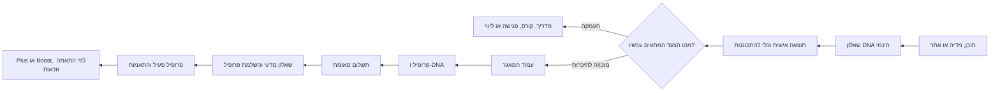

# ברנד בוק — סינתזה מותגית עבור הילית כספי

**גרסת סינתזה:** 24 בספטמבר 2026  
**מבוסס על:** שמונת דוחות המחקר בתיקייה זו, ניתוח קוד ונכסים ציבוריים כפי שתועדו בהם.  
**מטרת המסמך:** להעמיד מקור עבודה אחד לבריף, לקופי, לעיצוב, למוצר, למסעות לקוח ולקמפיינים — בלי להציג טענה מסחרית, תפעולית או מחקרית שאינה מגובה במקור המתועד.

> **מצפן המותג:** הילית כספי היא מומחית לזוגיות ומשדכת, שעוזרת לאנשים רציניים להבין את דפוסי הבחירה שלהם, לבחור אחרת ולהתקדם להיכרות רלוונטית. הדרך משלבת כלים מעשיים, נתונים ככלי עזר ושיקול דעת אנושי — בחום, בכבוד ובדיסקרטיות. היא אינה מבטיחה זוגיות, דייט, מספר התאמות או זמן לתוצאה. [1] [4]

## עקרון-העל: סמכות עם לב

המותג צריך להרגיש כמו **סמכות אינטימית**: ידע מסודר, בהירות והובלה מעשית מצד אחד; חום, הכרה בעייפות, תקווה מציאותית ודיסקרטיות מצד אחר. זה אינו מותג של אפליקציה שמציעה גלילה, גם אינו מותג של שדכנות מסורתית המבוססת על פרטים יבשים בלבד, ואינו טיפול נפשי. הוא מערכת מקצועית אחת שבה תוכן, התבוננות, תרגול, ליווי והזדמנויות היכרות יכולים לשרת שלבים שונים של אותה דרך. [1] [2]

העיקרון המנחה לכל החלטה הוא: **אמון קודם להייפ.** לכן יש לבחור בניסוח שמסביר את התהליך ואת גבולותיו, גם כאשר הוא פחות דרמטי מהבטחת תוצאה. בעיצוב, בקופי ובמוצר, המשתמש או המשתמשת אמורים להרגיש שרואים את המורכבות שלהם, אך גם שמובילים אותם לצעד הבא בביטחון.

---

# 1. סיפור ומיצוב

## 1.1 הסיפור שהמותג מספר

הסיפור אינו על נוסחה למציאת אהבה, אלא על אנשים חכמים, מצליחים ומוכנים לקשר שעדיין חוזרים לבחירות שאינן מקדמות אותם. נקודת המוצא היא שהקושי אינו מעיד שיש באדם משהו פגום; לעיתים חסרה לו מפה שמאפשרת לזהות דפוסי בחירה, להבין את המחיר שלהם, ולתרגל צעד אחר. הילית מביאה למפה זו מומחיות לזוגיות, שפה אנושית וכלים מעשיים; במאגר ההיכרות היא מוסיפה פרופיל עומק, נתונים והקשר אנושי. [1]

הנרטיב צריך לנוע בארבעה שלבים ברורים:

1. **עייפות וחוסר בהירות.** החיפוש באפליקציות, ההיכרויות השטחיות או החזרה על אותן בחירות משאירים תחושת עומס וחוסר כיוון.
2. **התבוננות במקום אשמה.** אפשר לזהות דפוס, צורך, פחד או הרגל בחירה מבלי לאבחן את האדם ומבלי לבייש אותו.
3. **תרגול ובחירה אחרת.** תובנה צריכה להפוך לצעד ממשי: שינוי קריטריונים, הכנה לדייט, תקשורת מדויקת יותר או השלמת פרופיל.
4. **היכרות מתוך הקשר.** כאשר מתאים לשלב החיים ולמטרה, המאגר פותח הזדמנויות היכרות מקצועיות, דיסקרטיות ובהסכמה הדדית.

המסע אינו מתחייב להגיע לנקודה רומנטית מסוימת. יעדו המותגי הוא **יותר בהירות, מוכנות ובחירה מודעת**, לצד אפשרות להגדיל את מספר הזדמנויות ההיכרות הרלוונטיות. [1] [4]

## 1.2 הגדרת המותג ומשפט המיצוב

> **הגדרת מותג:** הילית כספי היא מומחית לזוגיות ומשדכת, שעוזרת לרווקים ולרווקות להבין את דפוסי הבחירה שלהם, לבחור באופן מדויק יותר ולהתקדם להיכרות אמיתית באמצעות כלים מעשיים והתאמה מקצועית עם שיקול דעת אנושי. [1]

> **משפט מיצוב:** עבור רווקים ורווקות רציניים שנמאס להם לחפש באותה דרך, הילית כספי מציעה דרך מקצועית ואנושית לזוגיות: להבין דפוסי בחירה, לתרגל בחירה אחרת ולהתקדם להזדמנויות היכרות רלוונטיות. בניגוד לגלילה אקראית או לשדכנות המבוססת רק על פרטים יבשים, הדרך מחברת עומק אישי, נתונים ככלי עזר והקשר אנושי — בלי הבטחת תוצאה. [1]

הקטגוריה המומלצת היא **מומחיות לזוגיות והתאמה מקצועית לאנשים שמחפשים קשר רציני**. הגדרה זו שומרת את המותג רחב מספיק כדי להכיל תוכן, מדריכים, קורס, פגישה, ליווי, מאגר ושירותי המשך, בלי למחוק את תפקיד ההיכרות המקצועית או להפוך את כל המערכת ל״אפליקציה״. [1] [8]

## 1.3 ארבעת הבידולים שצריך לשמר

| בידול | המשמעות המעשית | ניסוח מותר | גבול חשוב |
|---|---|---|---|
| **מהיכרות לבחירה** | העבודה אינה מסתכמת באיתור אדם נוסף; היא כוללת הבנת דפוסים ותרגול. | „לא רק להכיר — גם להבין מה מנהל את הבחירות.” | אין להציג את השיטה כטיפול או כאבחון. |
| **נתונים עם אנושיות** | שאלונים וחישוב התאמה מסייעים לזהות אפשרויות, אך אינם עומדים לבדם. | „נתונים ככלי עזר, לצד בדיקה אנושית מקצועית.” | אין לומר „ללא אלגוריתם” או „האלגוריתם מנבא אהבה”. |
| **מערכת שלמה** | האדם יכול להתחיל בתוכן או ב-DNA, להעמיק במוצר דיגיטלי, בליווי או במאגר. | „אפשר לבחור את הצעד שמתאים לך עכשיו.” | אין להציג מסלול אחד כפתרון חובה לכולם. |
| **תקווה מציאותית** | המותג מכיר ברצון לאהבה, אך מוכר תהליך והזדמנויות ולא תוצאה. | „צעד קטן, מעשי ובהיר.” | אין להבטיח התאמה, דייט, זוגיות, כמות או זמן. |

הניסוח המאחד בין השכבות הוא: **„לא אלגוריתם לבדו ולא אינטואיציה לבדה: נתונים שמסייעים לזהות אפשרויות, לצד בדיקה מקצועית ושיקול דעת אנושי.”** בעמודי המאגר הרגיל, הבדיקה האנושית היא חלק מההצעה. ב-Boost, לעומת זאת, ההצעה האלגוריתמית **אינה נבדקת ידנית בידי הילית**; לכן יש לציין את ההבחנה בכל נכס שבו שני המסלולים מופיעים יחד. [4] [5]

## 1.4 הבטחת המותג, סיבה להאמין וגבולות

**הבטחת המותג:**

> **לא צריך להמשיך לחפש באותה דרך. אפשר להבין מה מנהל את הבחירות, לבחור אחרת ולהתקדם להיכרות מתוך יותר בהירות.** [1]

ההבטחה אמינה משום שהמערכת מציעה נקודות כניסה וכלי עבודה ממשיים: שאלון DNA ככלי להתבוננות, תוכן ומדריכים, קורס, פגישה, ליווי, פרופיל עומק, התאמה מקצועית ואישור הדדי. במאגר, פרטי קשר נחשפים רק לאחר שני אישורים. במוצרים הלימודיים והליווי, הערך הוא מסגרת עבודה, תרגול ומפת צעדים. [1] [3] [4]

| אפשר להבטיח | אין להבטיח |
|---|---|
| תהליך מקצועי, בהירות, כלים, תרגול, יחס מכבד ודיסקרטיות. | זוגיות, דייט, התאמה מסוימת, מספר הצעות, תדירות או זמן להשגת תוצאה. |
| במאגר: פרופיל, שאלונים, בחינת אפשרויות והסכמה הדדית לפני חשיפת פרטי קשר. | אימות זהות, בדיקת רקע או בדיקת מצב משפחתי, שלא מתבצעים לפי התנאים המתועדים. |
| ב-Plus: לפחות שתי הצעות חדשות שנבדקו ונשלחו בכל מחזור אישי, לצד Boost נוסף שאינו נספר במכסה. | אישור הדדי, פגישה, זוגיות, זמינות אישית בלתי מוגבלת או ליווי אישי מלא. |
| ב-Boost: יכולת בחירה עצמית מתוך אפשרויות אנונימיות ובהתאם לזכאות. | בדיקה ידנית של הילית להצעת Boost, חשיפת פרטי קשר או הצלחה כתוצאה מן התשלום. |

כל טענה על מחקר, „מדע”, מספר משתתפים, הצלחה או סיפור לקוח חייבת להיות מוצמדת למקור עדכני ולהסכמה מתועדת. ה-DNA צריך להיות מוצג כ**כלי להתבוננות בדפוסי קשר**, לא כאבחון קליני ולא כמנגנון שמנבא זוגיות. [1] [3]

## 1.5 קהלי יעד לפי שלב חיים ומוכנות

הליבה הרגשית של התוכן יכולה להישען במיוחד על נשים עצמאיות ומצליחות שמרגישות עייפות מן החיפוש, אך המותג והשירותים מיועדים לשפה כוללת כברירת מחדל. פנייה מגדרית אפשרית בקמפיין שבו הפרסונה מוגדרת במפורש; היא אינה צריכה לגלוש לסטריאוטיפים על תפקידי מגדר, משיכה או הצלחה. [1]

| קהל | המתח המרכזי | המסר המועיל | כניסה טבעית |
|---|---|---|---|
| גילי 27–34 | עייפות מאפליקציות, עומס וחיפוש לא ממוקד. | „לפני שממשיכים לגלול, אפשר להבין מה חוזר על עצמו.” | DNA או תוכן חינמי. |
| קריירה בגילי 35–42 | הצלחה בתחומים אחרים לצד תסכול מזוגיות ודפוסים חוזרים. | „אין בך משהו לא בסדר; אפשר לבנות מפה לבחירה אחרת.” | מדריך, פגישה או ליווי. |
| פרק ב׳, לרוב 43–62 | מורכבות חיים, ילדים, בשלות ורצון להתחיל מחדש בכבוד. | „לא צריך להתחיל מאפס; אפשר להכיר מתוך ניסיון ובהירות.” | פגישה, ליווי, מאגר ותוכן מותאם. |
| גברים ספקנים לגבי שדכנות | חשש משיפוטיות, מסורבלות וחוסר שקיפות. | „תהליך ברור, דיסקרטי ומכבד; לא מתקדמים בלי הסכמה.” | עמוד המאגר או DNA. |
| ארגונים וקהילות | צורך בתוכן פרקטי על זוגיות, דייטינג ואיזון חיים. | „תובנות עמוקות וכלים שאפשר לנסות כבר מחר.” | הרצאה, סדנה או ריטריט. |

## 1.6 ארכיטיפים

הארכיטיפ הדומיננטי הוא **החכמה/המדריכה**: עושה סדר, נותנת שם לתופעות וממירה בלבול למפה. אותו משלימים **המלווה/המטפלת** במובן הלא-קליני — מפחיתה בושה ומכבדת מורכבות — ו**המחברת/השדכנית**, שפותחת אפשרויות היכרות מתוך הקשר והסכמה. רומנטיקה היא שכבת אווירה קטנה בלבד, לא מנוע ההבטחה. יחס עבודה מומלץ: כ-45% מדריכה, 30% מלווה, 20% מחברת ו-5% אהובה/רומנטית. [1]

---

# 2. שפה וקול מותג

## 2.1 כללי כתיבה

העברית צריכה להיות פשוטה, קרובה לחיים, ישירה ולא שיפוטית. רצף הכתיבה המומלץ הוא: **להכיר בתחושה → לתת שם למה שקורה → להציע צעד אפשרי**. כך נוצרת סמכות שמועילה במקום סמכות שמטיפה. [1]

| מצב תקשורתי | טון | דוגמה מכוונת |
|---|---|---|
| תוכן תובנה | סקרן, בהיר ולא מאבחן. | „לפעמים פוסלים מהר כי המוכר מרגיש בטוח יותר מן הנכון.” |
| דף מכירה | בטוח, מסודר ושקוף. | „כך נראה התהליך, מה כלול בו ומה הוא לא מבטיח.” |
| פנייה רגשית | חומל ומכבד, בלי רחמים עצמיים. | „העייפות מהחיפוש מובנת. לא חייבים להישאר איתה לבד.” |
| המתנה להתאמה | רגוע, ענייני ושקוף. | „הצעה נשלחת כשיש אפשרות רלוונטית שעברה בדיקה, ולא לפי מכסה.” |
| עדות | אישי, קונקרטי ומאומת. | „הבנתי מה אני עושה אחרת בדייט הבא.” |
| טענה מקצועית | צנוע ומדויק. | „נשען על עקרונות מעולמות הפסיכולוגיה הזוגית.” |

יש להעדיף לשון כוללת או ניסוח ניטרלי כאשר אין צורך בפרסונה מגדרית. בפנייה מותאמת לקהל מוגדר, לשמור על כבוד, דיוק ופתיחות, ולא להשתמש בקיצורי דרך כמו „נשים חזקות מרתיעות גברים”. [1]

## 2.2 מילון עבודה

| תכלית | מילים וביטויים מומלצים |
|---|---|
| זהות | מומחית לזוגיות, משדכת, מלווה, מדריכה, שיטה, דרך, תהליך. |
| תובנה | דפוס, בחירה, בהירות, מפה, צורך, ערך, פחד, מוכנות, צעד הבא. |
| פעולה | לבדוק, לדייק, להבין, לתרגל, להתנסות, לבחור, להתקדם, להיפתח. |
| התאמה | רלוונטיות, הקשר, התאמה הדדית, בדיקה מקצועית, שיקול דעת אנושי, הסכמה. |
| רגש | בית, ביטחון, קשר, קרבה, כנות, תקווה מציאותית, אהבה. |
| פרטיות | דיסקרטי, בכפוף להסכמה, בקצב שלך, בכבוד, בלי הפתעות. |

| להימנע מ־ | הסיבה | חלופה |
|---|---|---|
| „האלגוריתם שמנבא אהבה” | הבטחת ניבוי שאינה מבוססת. | „כלי עזר שמזהה אפשרויות, לצד בדיקה אנושית.” |
| „התאמה מושלמת” או „נמצא לך את האחד/האחת” | הבטחת תוצאה ולחץ מיותר. | „נבדוק הזדמנויות להתאמה רלוונטית.” |
| „מדע מוכח” ללא מקור | טענה רחבה מדי. | „נשען על עקרונות מעולמות הפסיכולוגיה הזוגית.” |
| „אבחון DNA זוגי” | עלול להישמע קליני ודטרמיניסטי. | „שאלון DNA זוגי” או „כלי להתבוננות”. |
| „סינון קפדני”, „אנשים מאומתים”, „כולם איכותיים” | עלול לרמוז לבדיקות רקע או לשיפוט ערכי. | „פרופיל מפורט שעובר בדיקה מקצועית.” |
| „טיפול”, „ריפוי”, „טראומה” כשפת שירות | מטשטש גבול מול טיפול נפשי. | „ליווי, כלים, תרגול והתבוננות”. |
| „בלי אלגוריתם” | סותר את השימוש המתועד בנתונים וחישוב התאמה. | „לא אלגוריתם לבדו: נתונים לצד בדיקה אנושית.” |

## 2.3 מבנה מסרים לפי כוונה

שלושת עמודי התוכן הם: **להבין את הדפוס**, **לבחור ולפעול אחרת**, ו**להכיר בדרך מקצועית**. כל נכס תוכן צריך לשרת עמוד אחד לפחות ולהסתיים בפעולה מתאימה לשלב המוכנות. [1]

| שלב | מסר | פעולה מועדפת |
|---|---|---|
| קהל קר | „מה מנהל את הבחירות שלך באהבה?” | DNA, מדריך חינמי או מאמר. |
| קהל חם | „כבר זיהיתם דפוס? אפשר לתרגם אותו לצעד מעשי.” | מדריך, קורס, פגישה או ליווי. |
| מוכן להיכרות | „המאגר מיועד למי שמחפש היכרות רצינית ומוכן לתהליך מקצועי ומכבד.” | עמוד מאגר והצטרפות. |
| חבר/ת מאגר שממתינ/ה | „לא שולחים הצעה כדי לייצר כמות; מציעים כשיש אפשרות רלוונטית.” | עדכון פרופיל, השלמת שאלון או המתנה שקופה. |
| חבר/ת Plus | „יותר עבודה יזומה סביב הפרופיל, עם התחייבות שירות מוגדרת.” | אזור אישי, סטטוס מחזור ושירות Plus. |
| חבר/ת Boost | „יותר אפשרויות ובחירה בידיים שלך, תוך פרטיות והסכמה הדדית.” | אזור אישי; גילוי אלגוריתמי ברור. |

## 2.4 קופי מאושר כבסיס לעבודה

**כותרת בית:**

> **לא חייבים להמשיך לחפש באותה דרך.**  
> נבין מה מנהל את הבחירות שלך, נדייק את הצעד הבא ונפתח מקום להיכרות אמיתית.

**תיאור המאגר:**

> **היכרות מקצועית, לא גלילה אינסופית.**  
> ממלאים פרופיל ושאלון. כאשר עולה אפשרות רלוונטית, היא נבדקת באופן מקצועי ונשלחת לשני הצדדים. פרטי קשר נחשפים רק לאחר הסכמה הדדית. אין התחייבות למספר הצעות או לתוצאה.

**תיאור הליווי:**

> **לא רק להבין מה חוזר על עצמו — לתרגל דרך אחרת.**  
> בליווי נזהה דפוסים, נחדד צרכים ונתרגם תובנות לבחירות שאפשר לנסות בעולם האמיתי.

**קריאות לפעולה:** „גלו איזה דפוס מוביל את הבחירות שלכם”; „בחרו צעד קטן שיכול לשנות את הדרך שבה אתם יוצאים לדייט”; „בדקו אם המאגר מתאים למה שאתם מחפשים עכשיו”; „קבעו פגישת היכרות כדי למפות את הצעד הבא”. [1]

---

# 3. מערכת חזותית

## 3.1 DNA חזותי: סמכות אינטימית

מערכת הליבה משלבת נייבי כהה של ריכוז ואמון, קרם חם של מרחב ונשימה, וזהב של פעולה ותקווה. הקוד מכנה את הגישה במפורש **Intimate Authority — סמכות עם לב**. המראה המועדף הוא של קליניקה דיגיטלית מודרנית: נקייה, מרווחת, אישית ובטוחה; לא יוקרתית באופן מנוכר ולא רומנטית באופן מתקתק. [2]

| תפקיד | צבע | שימוש מומלץ |
|---|---:|---|
| נייבי ראשי | `#191265` | משטחי אמון, Hero, ניווט, footer, טקסט ראשי וכפתור כהה. |
| נייבי עמוק | `#0F0B3D` | מצב hover כהה ועמקות. |
| קרם | `#F0EADC` | רקעי תוכן, סקציות חמות ומשטחים בהירים. |
| זהב | `#FFE27C` | CTA ראשי, הדגשה, מספרים ואייקונים; להשתמש בו כדי לסמן בחירה ופעולה. |
| זהב כהה | `#E6C84A` | hover לזהב. |
| אפור-ביניים | `#727272` | טקסט משני ותיאור. |
| אפור-בהיר | `#E9E8E8` | גבולות שדות וכרטיסים. |
| סגול-כחול משני | `#1800AD` | הדגשה או הילה ב-Hero; יש לתעדו כאסימון ליבה. |

הזהב אינו קישוט סטטוס. הוא משמש לסמן החלטה, תובנה או פעולה. הקרם אינו רק רקע; הוא מאזן את הנייבי ומאפשר לטקסט רגשי לנשום. [1] [2]

## 3.2 תמות קמפיין אינן פלטת הליבה

דפי Plus, Boost, ט״ו באב וחבילת השנה החדשה משתמשים בתמות עצמאיות. הן יכולות ליצור חוויה ייחודית, אך אינן צריכות להחליף את שפת הליבה בדפי מותג או במוצרים שאינם קמפיין.

| תמה | מאפיינים | שימוש מורשה |
|---|---|---|
| **Plus** | ורוד-יין, קורל וזהב; לבבות עדינים, זכוכית מטושטשת ואווירה אישית-אופטימית. | מכירת Plus והזמנות ייעודיות. |
| **Boost** | סגול עמוק, מג׳נטה, זהב וזוהר דיגיטלי; כרטיסים אנונימיים. | בחירה עצמית, אנונימיות ושכבת מוצר דיגיטלית. |
| **ט״ו באב** | ורוד-רומנטי, סגול כהה, לבבות מונפשים. | קמפיין עונתי בלבד; אינו שפת מוצר קבועה. |
| **חבילת השנה החדשה** | אדמה, שמנת, חום-שחור ופרחים. | קמפיין חג בלבד. |

יש להגדיר אסימוני עיצוב נפרדים לכל קמפיין, כגון `--campaign-plus-*`, ולמנוע זליגה מקרית של צבעי קמפיין לממשק הליבה. [2]

## 3.3 טיפוגרפיה, היררכיה ופריסה

Rubik היא משפחת הגופן של האתר. היא נטענת במשקלים 300–700, בעוד שכותרות שיווקיות משתמשות לעיתים תכופות ב-`font-black` ובמחלקת תצוגה של משקל 800. עד לטעינה מפורשת של משקלי 800/900, יש לבחור משקל טעון או לעדכן את טעינת הגופן; אחרת הדפדפן עלול לסנתז משקל שאינו עקבי. [2]

| תפקיד | יישום רצוי |
|---|---|
| Hero | Rubik כבד, קצר וברור; בסולם הקיים `text-4xl` במובייל ועד `text-6xl` בליבה. |
| כותרת מקטע | כותרת כבדה עם line-height צפוף; לרוב `text-3xl` עד `text-4xl`. |
| כותרת כרטיס | ברורה וקצרה; `text-lg` עד `text-2xl`. |
| טקסט גוף | `text-sm` עד `text-lg`, מרווח שורות נדיב והיררכיה רגועה. |
| תנאים ומיקרו-קופי | קטן אך קריא; לא לדחוס מידע מהותי לגודל זעיר. |

המעטפת המותגית עובדת היטב עם Hero דו-טורי בדסקטופ וטורי במובייל, דיוקן אנכי של הילית או של אדם רלוונטי, halo רדיאלי עדין וכפתור זהב. כרטיסי שיווק בהירים הם בדרך כלל קרם או לבן, עם גבול עדין, רדיוס גדול (`rounded-2xl` או `rounded-3xl`) וצל מאופק. כרטיס מודגש יכול להיות נייבי עם טקסט לבן וזהב. [2]

## 3.4 כפתורים, טפסים ומשוב

ה-CTA הראשי הוא זהב על נייבי, במשקל כבד, ברדיוס גדול ובמרחב לחיץ נדיב. פעולה משנית צריכה להיות outline או כפתור נייבי. כפתור WhatsApp, אם הוא נדרש, נשאר ירוק פונקציונלי ולא צבע מותג חלופי. יש לאחד את וריאציות ה-CTA השיווקיות לרכיב משותף, במקום להמשיך לעצב כפתורים מקומיים בכל עמוד. [2]

טפסים צריכים להיות מיושרים לימין ב-RTL, עם שדות מרווחים, גבול עדין ומצב focus בולט. בכל תשלום צריך להציג את סוג החיוב, המחיר, ההסכמות והפעולה הבאה בשפה ישרה; בהקשר של Plus יש להבליט שמדובר בחיוב חודשי מתחדש, ובהקשר של מאגר ו-Boost להבליט שמדובר בחיוב חד-פעמי בהתאם למוצר. [2] [4] [5] [6]

## 3.5 צילום, איור ופרטיות

הצילום הראשי הוא אישי, חם ואנכי: דיוקנאות מוארים, לבוש נגיש, רקעים קרמיים או חמים ונוכחות מקצועית שאינה פורמלית מדי. יש להשתמש בצילומים אנכיים על פי תפקידם — `hero`, `editorial`, `profile` או `podcast` — ולשמור על מוקד פנים עקבי בכל breakpoint. [2]

הצילום צריך להציג אנשים אמיתיים ומגוונים בגיל, במראה ובשלב החיים. אסור לייצר מצג של מאגר „איכותי” באמצעות סמלי סטטוס או טיפוסים סטריאוטיפיים. בעדויות, צילומי מסך ובכרטיסי התאמה יש לטשטש מידע מזהה ולהשתמש רק בחומרים שקיבלו הסכמה מפורשת לערוץ המדויק של הפרסום. [1] [5]

## 3.6 RTL, מובייל ונגישות

עברית ו-RTL הם ברירת המחדל. כל עמוד אנגלי צריך להגדיר במפורש `dir="ltr"`; עמוד הדיבור האנגלי תועד כחריג שיורש RTL ויש לתקנו. ברכיבים רב-לשוניים עדיף להשתמש במאפייני התחלה/סיום לוגיים במקום מיקומי ימין/שמאל קשיחים. [2]

במובייל, הטקסט והפעולה צריכים להופיע לפני עומס דקורטיבי. CTA יכול להיערם לעמודה, Hero צריך לעבור למבנה טורי, ותנועה צריכה להיות עדינה. יש להוסיף תמיכה מפורשת ב-`prefers-reduced-motion` ולהסיר את הגבלת הזום (`maximum-scale=1`) כדי לאפשר הגדלה למשתמשים הזקוקים לה. [2]

---

# 4. אקוסיסטם מוצרים

## 4.1 עקרון הארכיטקטורה

המערכת הישראלית בנויה כרצף: **תובנה חינמית → כלי או שירות להעמקה → ליווי או מאגר → שירותי המשך לחברי המאגר**. המשתמש אינו חייב לעבור בכל התחנות. תפקיד המותג הוא להתאים את הצעד למידת המוכנות, ולא להציג מוצר אחד כפתרון לכל אדם. [8]

| שכבה | מוצר או מסלול | מחיר מתועד | התפקיד המותגי |
|---|---|---:|---|
| גילוי | שאלון DNA | חינם | כלי התבוננות, לכידת ליד ותוצאה אישית; אינו אבחון. |
| גילוי | מדריך חינמי ותוכן | חינם | בניית אמון, חינוך והנעה לצעד הבא. |
| תרגול | „לבחור נכון” | 149 ₪ חד-פעמי | מדריך עבודה דיגיטלי לתרגול והעמקה. |
| למידה | „המסע — מהפחד לבחירה” | 249 ₪ חד-פעמי | קורס עומק דיגיטלי הכולל מודולים וכלי עבודה. |
| בהירות אישית | פגישה בודדת | 500 ₪ | מיפוי דפוסים והגדרת הצעד הבא; מחיר Plus מוצג בנפרד כהטבה לחברים זכאים. |
| ליווי | ליווי אישי | 2,960 ₪ ל-8 פגישות או 4,200 ₪ ל-12 פגישות | עבודה 1:1; כולל גישה למאגר לפי המיפוי המתועד. |
| היכרות | מאגר הרווקים והרווקות | 299 ₪ חד-פעמי | פרופיל, שאלונים, חישוב התאמה ככלי עזר, בדיקה אנושית, פרטיות ואישור הדדי. |
| הרחבת שירות | Database Plus | 99 ₪ לחודש, מתחדש עד ביטול | לפחות שתי הצעות חדשות שנבדקו ונשלחו בכל מחזור, Boost אחד נוסף וקדימות מוגדרת. |
| בחירה עצמית | Boost | הצטרפות חינם; 19.90 ₪ לכל שליחה עצמאית | אפשרויות אלגוריתמיות אנונימיות לחברי מאגר זכאים; אישור הדדי לפני חשיפת קשר. |

המחירים בטבלה הם המחירים המתועדים במקורות המחקר נכון למועד הבדיקה, ולא הוראה לפרסם מחיר ללא בדיקה מסחרית נוספת. במיוחד, מחיר הייחוס המוצג של 499 ₪ למאגר אינו מתועד בדוח כמחיר שוטף שנגבה בעבר; עד לאימות מול חיובים או חשבוניות יש לכנותו **„מחיר ייחוס מוצג”**, ולא „מחיר היסטורי מאומת”. [4] [8]

## 4.2 המאגר: מוצר הליבה של ההיכרות

המאגר הוא **שירות היכרות דיסקרטי**, לא אפליקציה ולא שדכנות מסורתית בלבד. הוא מחבר פרופיל עומק, שאלון DNA, שאלון מדעי לאחר תשלום, נתוני העדפות וחישוב התאמה עם בחינה אנושית של הילית לפני הצעה רגילה. ההצעה נשלחת לשני הצדדים בנפרד, ופרטי קשר נחשפים רק לאחר שני אישורים. [4]

ששת ממדי ההתאמה המתועדים הם התקשרות, כימיה ומשיכה, ערכים ומניעים, מוכנות לזוגיות, קצב חיים וכיוון עתידי. הם יכולים להסביר את עומק התהליך; הם אינם היתר לטעון לדיוק מדעי מוחלט או לניבוי. התשלום המאומת הוא עבור כניסה למאגר, פרופיל והשתתפות בתהליך המקצועי — לא עבור ליווי אישי, מכסת התאמות או תוצאה זוגית. [4]

## 4.3 Database Plus: יותר עבודה יזומה עם התחייבות צרה

Plus הוא מנוי חודשי אישי לתהליך ההיכרויות. ההבטחה הניתנת למדידה היא **לפחות שתי הצעות התאמה חדשות שנבדקו ונשלחו בפועל בכל מחזור חיוב אישי**. Boost אחד נוסף כלול במחזור, אך אינו נספר בשתי ההצעות, משום שהוא אלגוריתמי ולא נבדק ידנית על ידי הילית. [6]

השפה הנכונה ל-Plus היא „יותר עבודה יזומה סביב הפרופיל”, ולא „יותר אהבה” או „ליווי צמוד”. המוצר כולל קדימות בעבודה סביב הפרופיל, ערוץ שירות בעדיפות והתחייבות שירות ממוקדת. הוא אינו כולל זמינות 24/7, ליווי אישי מלא או התחייבות לאישור הדדי, דייט או זוגיות. [6]

המסלול תומך גם במי שעדיין אין להם פרופיל: לאחר תשלום, נשלח קישור אישי להשלמת פרופיל ושאלון, ורק לאחר ההשלמה המנוי מופעל. משום כך, אין להציג את Plus רק כתוספת לחברי מאגר קיימים בלי לוודא שהמדיניות הזו נשארת בתוקף. [6]

## 4.4 Boost: סוכנות עצמית בתוך גבולות ברורים

Boost מאפשר לחברי מאגר זכאים לראות עד שש אפשרויות אלגוריתמיות אנונימיות, עם ציון התאמה, מאפיינים כלליים ונימוקי התאמה. המשתמש או המשתמשת בוחרים אפשרות ושולחים הצעה לאחר בדיקת זכאות. ההצטרפות למסלול חינם; שליחת Boost עצמאי עולה 19.90 ₪ כולל מע״מ. [5]

הפרטיות מדורגת: בשלב הכרטיס אין שם, תמונה, עיר מדויקת, מקום עבודה מדויק או פרטי קשר. לאחר שליחה, שני הצדדים מקבלים שם, תמונה ופרטי פרופיל לצורך החלטה; פרטי קשר נחשפים רק לאחר שני אישורים. הצעת Boost חייבת להיות מסומנת בכל עת כ**אלגוריתמית ולא נבדקה ידנית בידי הילית**. [5]

| לא להתבלבל בין | Boost | התאמה רגילה של הילית |
|---|---|---|
| אופן הבחירה | החבר/ה בוחר/ת מתוך אפשרויות זמינות. | הילית בוחנת, מתעדפת ושולחת. |
| בדיקה ידנית לפני שליחה | אין. | יש, במסגרת המסלול הרגיל. |
| חשיפה ראשונית | כרטיס אנונימי. | הצעה שנשלחת לצורך החלטה. |
| תמחור | 19.90 ₪ לשליחה עצמאית, או Boost כלול ב-Plus. | חלק מהמאגר; Plus מוסיף התחייבות שירות נפרדת. |

## 4.5 מותג בינלאומי

לשוק הבינלאומי קיימת שכבה נפרדת, **[Match by Hilit](https://matchbyhilit.com/)**. יש להעדיף דומיין זה על פני נתיבי `/en/*` הוותיקים בדומיין הישראלי, כדי לצמצם כפילות תוכן ופיצול מדידה. לפני הפניית תנועה בתשלום למסע הבינלאומי יש ליישב את הפער המתועד בין מחיר מאגר של $99 בדף המכירה לבין $149 שמופיע במסע ה-DNA האנגלי. [8]

---

# 5. מסעות לקוח

## 5.1 מסע הליבה: DNA → מאגר → פרופיל פעיל

שאלון ה-DNA הוא שער גילוי, לא רק שדה ליד. הוא נותן תוצאה אישית של אחד מארבעה טיפוסים, אך לפני הצגתה נדרש המשתמש למסור פרטי קשר ולאשר קבלת תוצאות ועדכונים. עם ההשלמה נוצר או מתעדכן ליד ב-CRM, נשמר שיוך קמפיין כאשר הוא קיים, ונפתח מסע אימייל מותאם. [3]

לאחר תוצאה, המעבר למאגר צריך לשנות את המסגרת מ״להבין את עצמי״ ל״לבדוק אם תהליך היכרות מקצועי מתאים לי״. ה-CTA אינו צריך להבטיח ש״ימצאו לי התאמה״; עליו להסביר את הצעד הבא, את המחיר, את הפרטיות ואת העובדה שהשלמת השאלון המדעי נדרשת כדי להפוך לפרופיל פעיל. [3] [4]

## 5.2 הצטרפות, תשלום והפעלה

במסלול המתועד, המשתמש או המשתמשת משלימים פרופיל, משמרים או ממלאים DNA, ממשיכים לתשלום, ולאחריו מקבלים קישור אישי לשאלון מדעי. רק לאחר השלמת השאלון ואישור הפרופיל נכנסים לתהליך ההתאמות. יש להציג את הסדר הזה באותו אופן בדפי מכירה, בתנאים, במיילים ובדפי תודה. [3] [4]

תשלום Grow מאומת הוא מקור האמת לרכישה ולהכנסה. פיקסלים, דף תודה ואירועי פלטפורמות מדיה הם כלי מדידה משלימים בלבד; דף תודה אינו הוכחת עסקה. ההבחנה הזו חשובה גם לבריף: קריאייטיב ושיווק יכולים להתייחס לפעולות כמו צפייה, ליד והתחלת תשלום, אך דיווח עסקי צריך להישען על עסקאות מאומתות. [3]

## 5.3 טיפוח ודיוור

מסע DNA כולל שש נגיעות מותאמות לטיפוס ולמגדר, ומניע בהדרגה מתוצאה אישית להבנת השיטה, לתוכן, למאגר או לפגישה. אסור לנסח דחיפות, הנחה, „מאות” או סיפור הצלחה כאילו הם תקפים תמיד, אלא אם ההטבה, הנתון וההסכמה לתוכן נבדקו מחדש לפני משלוח. [3]

במסע נטישת תשלום למאגר נדרש תיקון תיעודי: לוגיקת הרצף מתזמנת הודעות ב-0/24/72 שעות מאז הפעלת המסע, בעוד שמסך ה-CRM מתאר את ההודעה השלישית בקירוב כ״אחרי 48 שעות״. עד ליישור, אין להשתמש בניסוח SLA מדויק במסמכי שירות או במצגות ביצוע. [3]

## 5.4 לאחר רכישה ושימור אמון

דף תודה ומייל לאחר רכישת מאגר צריכים להפחית אי-ודאות: להסביר שהתשלום התקבל, להוביל להשלמת השאלון המדעי, ולתאר בקצרה מה קורה לאחר מכן. מסע welcome מתועד בימים 0, 3, 7 ו-14, ומסביר את תהליך הבדיקה, אישור שני הצדדים והעובדה שזמן ההמתנה משתנה. [3]

ב-Plus, הדף והמסרים צריכים להציג את שתי ההצעות, את Boost הנוסף, את המחזור האישי ואת גבולות ההבטחה. ב-Boost, הממשק צריך להפריד בבירור בין מצב הצטרפות, פרופיל חסר, אין אפשרויות, בקשה פתוחה, המתנה לתגובה, אפשרויות זמינות וקרדיט. כל מצב צריך לומר מה קורה עכשיו, איזו פעולה אפשרית והאם בוצע חיוב. [5] [6]

## 5.5 מדידה — שימוש נכון בנתונים

המסלול המתועד מכיל אירועי PageView, Lead, ViewContent, CompleteRegistration, InitiateCheckout ו-Purchase בפלטפורמות פרסום, לצד מדידת אנליטיקה פנימית ו-GA4. לצורך ניהול מותג ושיווק חשוב להפריד בין ארבע שכבות: **תנועה**, **ליד/השלמת DNA**, **כוונת רכישה**, ו**עסקת Grow מאומתת**. [3]

שיוך UTM מסייע לניהול קמפיינים, אך אינו הוכחת סיבתיות: אדם עשוי להיחשף למודעה, לחזור ישירות, לפתוח אימייל ולפנות בערוץ שירות לפני קנייה. גם מדדי פתיחת אימייל ומדדי רכישה של Meta אינם ספר הכנסות. קיימת בנוסף נקודת אימות טכנית פתוחה לגבי שני Pixels שמאותחלים בדף בעוד שליחת האירועים נעשית באופן כללי; יש לאמת ב-Events Manager את הפיצול והכפילויות לפני שימוש במספרי אירועים כבסיס להחלטה. [3]

---

# 6. קמפיין ט״ו באב

## 6.1 סטטוס והצעה

ט״ו באב הוא **קמפיין היסטורי ועונתי**, לא הצעת ליבה פעילה כברירת מחדל. העמוד [ט״ו באב](https://hilitcaspi.com/tu-bav) היה זמין בזמן הבדיקה, אך הטקסט התייחס לחלון יולי 2026; שלושת קמפייני Meta שנמצאו תועדו כמושהים. אין להפנות אליו תנועה או להשתמש במחיריו בלי אישור מחודש של מועד, מלאי תפעולי, תנאים ותשלום. [7] [8]

ההצעה המתועדת הייתה חבילת **מאגר התאמות + המדריך הדיגיטלי „לבחור נכון”** ב-349 ₪ בתשלום חד-פעמי וללא מנוי. ההיגיון המותגי היה ברור: המאגר יוצר הזדמנויות היכרות והמדריך עוזר להגיע אליהן עם יותר בהירות. לאחר תשלום נשלחו נתיבי השלמת המאגר וגישה למדריך. [7]

## 6.2 שפה וקריאייטיב

הקמפיין השתמש בהבטחה עונתית רגשית-מעשית סביב יום האהבה הישראלי, עם הבחנה מאפליקציות, שאלון, התאמות אישיות, חבילה משולבת ודחיפות תאריך. מבחינה חזותית, הוא היה תמת קמפיין ורודה-סגולה: רקע כהה, לבבות SVG, גרדיאנטים ורודים וצילומים אישיים של הילית. [2] [7]

אם הקמפיין יופעל מחדש, יש לשמר את ההיגיון של **״להבין מה מחפשים, ואז להיפתח להזדמנויות היכרות״**; יש להסיר או לרכך הבטחות כגון „למצוא לך דייט לט״ו באב” אלא אם קיימת יכולת שירותית ספציפית, מאושרת ומתועדת לעמוד מאחוריהן. במקור נמצא גם ניסוח חריג של התאמה עד ערב החג לפלח מסוים; הוא היה טקטיקת סגמנטציה ולא הבטחת שירות כללית. [7]

## 6.3 ביצועים היסטוריים ודרך קריאה נכונה

בחלון Meta של 1 ביולי–10 באוגוסט 2026, שלושת קמפייני ט״ו באב תועדו יחד עם 110 אירועי Purchase מיוחסים, CPA של 35.12 ₪ ו-ROAS של 8.77. אלו נתוני **ייחוס של Meta**. הם אינם הכנסה חשבונאית, ולא צריך להציגם כהוכחה להכנסות סופיות. [7]

קיימת אי-התאמה מתועדת בין Meta, נתוני אתר ורשומות תשלום: הספירות, החלונות והגדרות המקור שונים. לפני שימוש ב-ROAS היסטורי לצורך תקציב או מצגת, יש לפייס בין חיובי Grow מאומתים, החזרים או ביטולים, טבלת תשלומים ומודל הייחוס של Meta. [7]

## 6.4 שער הפעלה מחודש

לפני השקה מחדש יש לאשר את כל התנאים הבאים:

1. תאריך הקמפיין, יכולת שירות, מחיר המכירה והמחיר המוצג לפני מבצע.
2. נוסח תנאי החבילה, תהליך האספקה והעמודים שלאחר רכישה.
3. תפקוד העברת קופון, אם נשלח קישור קופון; במחקר ההיסטורי לא נמצאה הוכחה ליישום אוטומטי שלו בעמוד.
4. התאמה בין כל הקריאייטיבים, עמוד הנחיתה והקופה — בפרט, לאחד את הפער המתועד בין 748 ₪ בעמוד לבין 749 ₪ בחלק מהמודעות.
5. הגדרת מקור אמת למדידה ודוח פיוס לאחר הקמפיין. [7]

---

# 7. נכסים וקישורים

## 7.1 עמודי ליבה בישראל

| נכס | תפקיד | סטטוס שימוש בברנד בוק |
|---|---|---|
| [דף הבית](https://hilitcaspi.com/) | סמכות, סיפור מותג ובחירת צעד ראשון. | עמוד ליבה. |
| [שאלון DNA](https://hilitcaspi.com/dna-quiz) | גילוי, תוצאה אישית ולכידת ליד. | עמוד ליבה; להציג ככלי להתבוננות. |
| [מאגר התאמות](https://hilitcaspi.com/database) | דף מכירה ראשי למאגר. | עמוד ליבה; ליישר מחיר, תהליך ושפת אלגוריתם. |
| [הצטרפות למאגר](https://hilitcaspi.com/join) | פרופיל, שאלון ותשלום. | פונקציונלי; לא להפנות עם פרמטרים אישיים. |
| [פגישת היכרות](https://hilitcaspi.com/single-session) | מיפוי אישי והגדרת צעד הבא. | עמוד שירות. |
| [ליווי אישי](https://hilitcaspi.com/coaching) | תהליך עומק 1:1. | עמוד שירות. |
| [המדריך „לבחור נכון”](https://hilitcaspi.com/guide) | מוצר דיגיטלי של תרגול. | עמוד מוצר. |
| [הקורס](https://hilitcaspi.com/course) | למידת עומק דיגיטלית. | עמוד מוצר; לבדוק קנוניקל מול `/course-sales`. |
| [Database Plus](https://hilitcaspi.com/database-plus) | מנוי והרחבת שירות. | עמוד מוצר; כפוף לבדיקת תפעול ותנאים. |
| [Match Boost](https://hilitcaspi.com/match-boost) | הבעת עניין והפעלת גישה אישית לחברי מאגר. | עמוד מוצר מוגבל לחברי מאגר; אינו מסלול תשלום ציבורי. |
| [Boost Now](https://hilitcaspi.com/boost-now) | הסבר ומעבר לאזור האישי עבור Boost. | עמוד מוצר לחברים זכאים. |

## 7.2 תוכן, אמון והפצה

דף [הבלוג](https://hilitcaspi.com/blog) הוא מרכז תוכן עבור SEO, אמון וחינוך. תועדו 13 מאמרים פומביים, ובהם הסבר על המאגר, DNA, ליווי ודייטינג. [8] נכס העדויות הציבורי המפורש הוא [סיפורי הצלחה](https://hilitcaspi.com/blog/sipurei-hatzlacha); יש לפרסם בו רק סיפורים מאומתים ובעלי הסכמה תואמת. [8]

ערוצי ההפצה הפומביים המתועדים כוללים את [Instagram ישראל](https://www.instagram.com/hilitcaspi_relationship/), [Facebook](https://www.facebook.com/hilitcaspirelationship), [TikTok](https://www.tiktok.com/@hilitcaspi_relationship), [Substack](https://substack.com/@hilitcaspi) ופודקאסטים. תפקידם הוא גילוי, חינוך, אמון ורימרקטינג — לא החלפת העמודים המסבירים את תנאי המוצר. [8]

## 7.3 נכסים שדורשים זהירות

- [דף הנחיתה `/maagar`](https://hilitcaspi.com/maagar) פעיל כנתיב קמפיין, אך מכיל פערים מתועדים ביחס לעמוד המאגר ולתקנון; אין להשתמש בו כבסיס יחיד לבריף עד ליישור.
- [ט״ו באב](https://hilitcaspi.com/tu-bav), [חבילת השנה החדשה](https://hilitcaspi.com/new-year-love), [מבצע ספטמבר](https://hilitcaspi.com/september) ו-[לייב](https://hilitcaspi.com/live) הם עונתיים או נכסי מורשת. HTTP 200 אינו אישור שהמבצע פעיל או שהקופה זמינה. [8]
- אזורים אישיים, עמודי גישה לתוכן, שאלונים לאחר תשלום, עמודי תודה וטפסי עדות עשויים לדרוש הזדהות או קישור אישי. לא מפרסמים כתובות עם פרמטרים אישיים, לא מציגים אותן במדיה, ולא מכניסים אותן לאינדקס. [8]
- נכסי `/pages/:slug` הדינמיים לא נמנו בדוח משום שאין אינדקס ציבורי או גישת צוות לרשימה. אין להניח שהמיפוי ממצה אותם. [8]

---

# 8. הנחיות למעצב/ת

## 8.1 מה חייב להישאר בכל נכס ליבה

1. **תחושה:** סמכות רגועה עם חום אנושי. התוצאה צריכה להיות „מישהו מבין אותי ומוביל אותי צעד אחד קדימה”, לא „מערכת משדכת אוטומטית” ולא „גורו שמבטיח נס”.
2. **היררכיה:** כאב או תובנה קצרים, הבטחה צנועה, הסבר תהליך, הוכחה תפעולית, גבול ברור ו-CTA יחיד עיקרי.
3. **צבע:** נייבי/קרם/זהב כברירת מחדל. הזהב מסמן פעולה, לא ממלא את המסך. צבעי Plus, Boost וחגים נשמרים רק להקשר הקמפייני שלהם.
4. **טיפוגרפיה:** Rubik; כותרות כבדות אך לא צפופות; טקסט גוף נושם ומיושר ל-RTL. יש לסגור את פער משקלי הגופן לפני הסתמכות על משקל 800/900.
5. **צילום:** דיוקנאות חמים, אמיתיים ונגישים; גיוון אמיתי, ללא סמלי סטטוס או תמונות גנריות שמבטיחות „זוגיות מושלמת”.
6. **פעולה:** CTA גדול ונגיש. ברירת המחדל היא זהב על נייבי; פעולה משנית ב-outline. אין להשתמש בלבבות, נוצצים או גרדיאנטים במקום הסבר מוצר.

## 8.2 דפי מוצר: מבנה שניתן למחזר

### מאגר

Hero צריך להבהיר חלופה לגלילה: תהליך עומק, נתונים ככלי עזר, בדיקה אנושית, פרטיות ואישור הדדי. מיד אחריו יש להציג את רצף התהליך האמיתי ואת גבולות ההבטחה. בכל מקום שבו מופיע „בדיקה” יש להימנע משפה שרומזת לבדיקת רקע או אימות זהות. [4]

### Plus

העמוד יכול להיות רך, ורוד ואישי יותר, אך חייב לתרגם את הרגש לפרטים: 99 ₪ בחיוב מתחדש, שתי הצעות שנבדקו ונשלחו בכל מחזור אישי, Boost אחד נוסף, קדימות ושירות. ליד Boost יש גילוי ברור שהוא אלגוריתמי ואינו נבדק ידנית. [6]

### Boost

העיצוב צריך להמיר פרטיות לנכס: כרטיסים אנונימיים, צללית במקום תמונה, מידע חלקי לפני שליחה, ואינדיקציה ברורה למצב. המסך אינו דומה ל-feed של אפליקציית דייטינג; הוא עוזר לקבל החלטה מבוקרת בתוך שירות היכרות. נדרש גילוי קריא שההצעה אלגוריתמית ולא נבדקה ידנית. [5]

## 8.3 רכיבים ומצבים

| רכיב | הנחיה |
|---|---|
| Hero | נייבי, halo עדין, טקסט קצר, דיוקן אנכי, CTA ברור. |
| כרטיס תועלת | קרם/לבן, גבול עדין, רדיוס גדול; לכל כרטיס נקודה אחת ולא רשימת הבטחות. |
| מחיר | בולט, נגיש ונכון לסוג החיוב; לא להסתיר חיוב מתחדש במיקרו-קופי. |
| תהליך | 3–5 שלבים, בשפה אנושית ובסדר המוצר האמיתי. |
| FAQ | מקום לגבולות ההבטחה, פרטיות, מחיר וביטול; לא לשכפל טענות לא מאומתות. |
| סטטוס אישי | לומר במפורש מה קרה, מה טרם קרה ומה הפעולה הבאה; לא ליצור תחושת המתנה עמומה. |
| תנועה | fade-up עדין, hover מאופק ותמיכה ב-reduced motion. |

## 8.4 פרטיות בעיצוב

אין להציג מידע אישי או מזהה בתיקי עיצוב, בדמו, בצילומי מסך או ב-case studies. בכרטיסי Boost יש לשמר אנונימיות בשלב הראשון. בעדויות יש להפריד הסכמה לטקסט, תמונה, וידאו, אתר ופרסום ממומן. אזורים אישיים ועמודי אספקה צריכים להיות מוגנים ולא מקודמים כעמודי נחיתה. [1] [5] [8]

---

# 9. פערים לאימות וליישור

הטבלה הבאה היא רשימת בקרה לפני פרסום, קמפיין או עיצוב מחדש. היא אינה קובעת מדיניות חדשה; היא מצביעה על סתירות או מגבלות שתועדו במחקר ועל ההכרעה הנדרשת.

| עדיפות | פער או שאלה | ההכרעה/הפעולה הנדרשת |
|---|---|---|
| גבוהה | **אלגוריתם מול בדיקה אנושית.** עמודים שונים מציגים חישוב התאמה, „לא אלגוריתם” או „אני לא אלגוריתם”. | לאמץ ניסוח אחיד: „נתונים ככלי עזר; הילית בודקת התאמות רגילות.” להבהיר ש-Boost הוא חריג אלגוריתמי שאינו נבדק ידנית. [1] [4] [5] |
| גבוהה | **תקופת פעילות במאגר.** התקנון מתאר 12 חודשים, ו-FAQ קמפייני מתאר היעדר תאריך תפוגה. | להכריע לפי מדיניות משפטית ותפעולית, ואז לעדכן תקנון, FAQ, דפי מכירה ומיילים. [1] [4] |
| גבוהה | **סדר ההצטרפות.** נכסים שונים מציגים סדר שונה של פרופיל, DNA, תשלום ושאלון. | להציג בכל נכס את הסדר הממומש: פרופיל → DNA → תשלום → שאלון מדעי/אישור → התאמות. [3] [4] |
| גבוהה | **מחיר ייחוס של 499 ₪ למאגר.** הוא מוצג פומבית, אך המחקר לא מצא ראיה מספקת שנגבה כמחיר שוטף. | לאמת מול Grow/חשבוניות. עד אז להגדירו „מחיר ייחוס מוצג” ולא מחיר היסטורי מאומת. [4] |
| גבוהה | **טענות מדעיות.** יש ניסוחים על „מחקרים מוכחים”, מתמטיקה או ניבוי. | להוסיף מקורות מתאימים ואישור משפטי, או לרכך לשפת עקרונות וכלי עזר. [1] [4] |
| גבוהה | **„סינון” ואישור פרופיל.** התנאים מציינים שאין בדיקות רקע, זהות או מצב משפחתי. | להחליף „סינון קפדני” ב„בדיקת פרופיל והתאמה לתנאי השירות”; לא לומר „מאומת”. [1] [4] |
| בינונית | **מי מקיים פגישת היכרות.** חלק מהמסרים מרמזים לפגישה ישירה עם הילית, אך מקור אחר מאפשר צוות מקצועי בהנחייתה. | לנסח מראש ובאופן אחיד את המדיניות המעשית. [1] |
| בינונית | **Plus: תקנון והפעלת כשל חיוב.** התקנון מסומן כטיוטה משפטית, ולא נמצאה אוטומציה ייעודית להודעת כשל חיוב. | לקבל אישור משפטי ולהגדיר תהליך שירות לפני שמבטיחים טיפול אוטומטי בכשל חיוב. [6] |
| בינונית | **Plus: קיבולת וטענות הטבה.** תועדה קיבולת פיילוט ותצורת הנחות שחלקה מנוהלת במסד נתונים. | לאשר זמינות לפני קידום ולהימנע מפירוט הנחה שלא נבדקה במערכת החיה. [6] |
| בינונית | **מחיר Boost.** בקוד תועדו 19.90 ₪, וביעדי ספטמבר הופיע 19.99 ₪. | לקבע סכום אחד בקופה, בנכסים, במדידה ובדיווח. [4] [5] |
| בינונית | **תזמון נטישת עגלה.** תיעוד CRM מדבר על 48 שעות, בעוד הרצף המתועד מגיע ל-72 שעות מאז תחילתו. | ליישר תיעוד או לוגיקה לפני הצגת SLA. [3] |
| בינונית | **מדידת Meta.** שני Pixels מאותחלים, בעוד האירועים נשלחים בממשק כללי. | לבדוק בפלטפורמת המדיה פיצול, כפילויות ויעד CAPI לפני הסתמכות על אירועי Lead או Purchase. [3] |
| בינונית | **קמפיינים עונתיים ונכסי מורשת.** עמודים עשויים להישאר זמינים גם אחרי מועד או מבצע. | לנטרל, להפנות או לסמן שהקמפיין הסתיים; לא להסתמך על HTTP 200 כאישור פעילות. [7] [8] |
| בינונית | **קנוניקל וכפילות.** קיימים נתיבי מכירה מקבילים בישראל ונתיבי `/en` לצד Match by Hilit. | להגדיר כתובת קנונית, הפניות, תגי canonical ותיוג אנליטיקה אחיד. [8] |
| בינונית | **מסע ארה״ב.** מוצגים $99 ו-$149 במקומות שונים במאגר הבינלאומי. | ליישב מחיר ותנאי לפני רכישת מדיה בינלאומית. [8] |
| שוטפת | **עדויות ונתוני הצלחה.** כל ציטוט, תמונה, וידאו או מדד מחייב מקור והסכמה תואמת. | להפעיל רשימת בקרה ותיעוד הסכמה לפני פרסום. [1] [8] |

## רשימת בקרה קצרה לפני פרסום

לפני כל דף, מודעה, מייל, פוסט או מסך חדש יש לוודא: האם מדובר בהבטחת תהליך ולא תוצאה; האם כל טענה על מחקר, מחיר, תוקף, נתון או הצלחה מאומתת; האם יש גילוי נכון על אלגוריתם, בדיקה אנושית ופרטיות; האם החיוב וסוגו גלויים; האם השפה כוללת, ישירה ומכבדת; והאם השפה החזותית שייכת לליבה או לקמפיין מובחן. [1] [2] [4]

---

# מקורות

[1]: file:///home/ubuntu/hilit-caspi-il/docs/brand-book-research/01-brand.md "תשתית מותג מבוססת־קוד: הילית כספי"
[2]: file:///home/ubuntu/hilit-caspi-il/docs/brand-book-research/02-visual.md "מערכת חזותית — הילית כספי"
[3]: file:///home/ubuntu/hilit-caspi-il/docs/brand-book-research/03-dna-funnel.md "מפת משפך שאלון ה-DNA החינמי → CRM, אימיילים ורכישת המאגר"
[4]: file:///home/ubuntu/hilit-caspi-il/docs/brand-book-research/04-database.md "מיפוי מותג ומסחר — מאגר הרווקים של הילית כספי"
[5]: file:///home/ubuntu/hilit-caspi-il/docs/brand-book-research/05-boost.md "Boost — מיפוי מוצר, עמודים ואזור אישי"
[6]: file:///home/ubuntu/hilit-caspi-il/docs/brand-book-research/06-plus.md "Database Plus — מיפוי הצעה, מסע לקוח ושפה מותגית"
[7]: file:///home/ubuntu/hilit-caspi-il/docs/brand-book-research/07-tu-bav.md "מחקר קמפיין ט״ו באב — מאגר התאמות + מדריך"
[8]: file:///home/ubuntu/hilit-caspi-il/docs/brand-book-research/08-assets-products.md "מיפוי נכסים ציבוריים ומוצרים — הילית כספי / Match by Hilit"
