# הילית כספי
## ברנד בוק לאתר, לסושיאל, למוצרים ולקמפיינים

**גרסה 1.0 | 24 בספטמבר 2026**

> **מצפן המותג:** הילית כספי היא מומחית לזוגיות ומשדכת, שעוזרת לאנשים רציניים להבין את דפוסי הבחירה שלהם, לבחור אחרת ולהתקדם להיכרות רלוונטית. הדרך משלבת כלים מעשיים, נתונים ככלי עזר ושיקול דעת אנושי, בחום, בכבוד ובדיסקרטיות.

המסמך נועד להיות מקור העבודה המרכזי למעצבים, קופירייטרים, עורכי וידאו, מנהלי קמפיינים, אנשי מוצר ושותפים. הוא מבוסס על הקוד החי של האתר, עמודי המוצר, מסעות הלקוח, נתוני הקמפיינים שנשמרו, הנכסים הציבוריים והמחירים המתועדים במערכת נכון ליום הבדיקה.[1][2][3][4][5][6][7][8]

---

# 1. תקציר מותג

## 1.1 רעיון העל

**סמכות עם לב.** המותג של הילית צריך להרגיש כמו סמכות אינטימית: מקצועי ומדויק, אבל אנושי; רומנטי, אבל לא מתקתק; מתקדם וטכנולוגי, אבל לא קר; אישי, אבל לא תלוי בהבטחה בלתי אפשרית לתוצאה.

האתגר של הקהל אינו רק למצוא עוד אדם להכיר. האתגר הוא להבין מדוע בחירות מסוימות חוזרות, מה חשוב באמת, איך נראית מוכנות לקשר, ואיך פותחים הזדמנויות היכרות מתוך יותר דיוק ופחות שחיקה. הילית מחברת בין שלושה עולמות שבדרך כלל חיים בנפרד: **ידע וכלים**, **שיקול דעת אנושי**, ו**מערכת היכרות מקצועית**.

## 1.2 משפט המיצוב

> עבור רווקים ורווקות רציניים שנמאס להם לחפש באותה דרך, הילית כספי מציעה דרך מקצועית ואנושית לזוגיות: להבין דפוסי בחירה, לתרגל בחירה אחרת ולהתקדם להזדמנויות היכרות רלוונטיות. בניגוד לגלילה אקראית או לשדכנות המבוססת רק על פרטים יבשים, הדרך מחברת עומק אישי, נתונים ככלי עזר והקשר אנושי.

## 1.3 הבטחת המותג

> **לא צריך להמשיך לחפש באותה דרך. אפשר להבין מה מנהל את הבחירות, לבחור אחרת ולהתקדם להיכרות מתוך יותר בהירות.**

המותג אינו מבטיח זוגיות, דייט, מספר התאמות או זמן לתוצאה. הוא כן מבטיח תהליך מקצועי, שפה ברורה, כלים, תרגול, כבוד, פרטיות והזדמנויות רלוונטיות בהתאם למוצר ולזכאות.

## 1.4 הסיבה להאמין

המערכת אינה נשענת על סיסמה בלבד. יש בה שאלון DNA להתבוננות בדפוסי קשר, תוכן מקצועי, מדריך וקורס עם תרגול, פגישה וליווי אישי, מאגר עם פרופיל עומק ושאלון מדעי, התאמות רגילות שנבדקות באופן מקצועי, ומסלולי המשך כמו Database Plus ו-Boost. במאגר, פרטי קשר נחשפים רק לאחר אישור הדדי.

## 1.5 מה המותג איננו

המותג אינו אפליקציית דייטינג, אינו שירות גלילה, אינו שדכנות מסורתית המבוססת רק על גיל ועיר, אינו טיפול נפשי, ואינו מנגנון שמנבא אהבה. שאלונים ונתונים הם כלי עזר; הם אינם מחליפים שיקול דעת, הסכמה וחיים אמיתיים.

---

# 2. הסיפור של הילית

## 2.1 סיפור המותג

הסיפור אינו על נוסחה קסומה למציאת אהבה. הוא מתחיל באנשים חכמים, עצמאיים ומוכנים לקשר, שמצליחים בתחומים רבים ועדיין מוצאים את עצמם חוזרים לאותן בחירות, מתעייפים מאפליקציות או מתקשים לזהות מה באמת מתאים להם. נקודת המוצא של הילית אינה שיש בהם משהו פגום. לעיתים חסרה מפה.

הילית מתרגמת מורכבות למפה מעשית. היא עוזרת לזהות דפוסים, להבין מה מושך ומה באמת מתאים, להפריד בין כימיה לבין זמינות, ולבחור צעד אחר. כאשר האדם מוכן להיכרות, המערכת פותחת גם הזדמנויות דרך מאגר מקצועי ודיסקרטי.

הנרטיב המומלץ לכל הרצאה, עמוד, סרטון או קמפיין נע בארבעה שלבים:

1. **עייפות וחוסר בהירות.** החיפוש הקיים אינו מייצר תוצאה מספקת.
2. **התבוננות ללא אשמה.** אפשר לזהות דפוס בלי לאבחן ובלי לבייש.
3. **בחירה ותרגול.** תובנה הופכת לפעולה, לדייט אחר, לקריטריון מדויק או לשיחה שונה.
4. **היכרות מתוך הקשר.** כאשר מתאים, המאגר פותח אפשרויות בהסכמה ובדיסקרטיות.

## 2.2 ארבעת עמודי הבידול

| בידול | המשמעות | הוכחה מוצרית | ניסוח מוביל |
|---|---|---|---|
| **מהיכרות לבחירה** | לא רק למצוא אדם נוסף, אלא להבין איך בוחרים | DNA, מדריך, קורס, ליווי | „לא רק להכיר. להבין מה מנהל את הבחירות.” |
| **נתונים עם אנושיות** | שאלונים וחישוב מסייעים, אך אינם עומדים לבדם | שאלון מדעי, פרופיל, בדיקה מקצועית | „לא אלגוריתם לבדו ולא אינטואיציה לבדה.” |
| **מערכת שלמה** | אפשר להתחיל בחינם ולהעמיק לפי מוכנות | תוכן, מוצרים, ליווי, מאגר | „אפשר לבחור את הצעד שמתאים עכשיו.” |
| **תקווה מציאותית** | תקווה לאהבה בלי למכור הבטחת תוצאה | גבולות שירות, פרטיות והסכמה | „צעד קטן, מעשי ובהיר.” |

## 2.3 ארכיטיפים

הארכיטיפ הראשי הוא **המדריכה החכמה**: עושה סדר, נותנת שם למה שקורה וממירה בלבול למפה. לצדה פועלים **המלווה**, שמפחיתה בושה ומחזיקה מורכבות, ו**המחברת**, שפותחת הזדמנויות בין אנשים. שכבת הרומנטיקה קיימת, אך היא אווירה ולא הבטחת המוצר.

חלוקת משקל מומלצת: 45% מדריכה, 30% מלווה, 20% מחברת, 5% רומנטיקה.

## 2.4 פרסונות עיקריות

| קהל | מה מרגישים | מה צריך לשמוע | צעד ראשון |
|---|---|---|---|
| גילי 27–34 | עייפות מאפליקציות וחיפוש לא ממוקד | „אפשר להבין מה חוזר על עצמו לפני שממשיכים לגלול.” | שאלון DNA או תוכן |
| גילי 35–42 בקריירה | הצלחה בחיים לצד תסכול בזוגיות | „אין בך משהו לא בסדר. אפשר לבנות מפה לבחירה אחרת.” | מדריך, קורס, פגישה או ליווי |
| פרק ב׳ וגילי 43–62 | מורכבות חיים ורצון להתחיל מחדש בכבוד | „לא צריך להתחיל מאפס. אפשר להכיר מתוך ניסיון ובהירות.” | פגישה, ליווי או מאגר |
| גברים ספקנים | חשש משיפוטיות ומסורבלות | „תהליך ברור, דיסקרטי ומכבד. לא מתקדמים בלי הסכמה.” | DNA או עמוד המאגר |
| ארגונים וקהילות | צורך בתוכן רגשי פרקטי | „תובנות עמוקות וכלים שאפשר לנסות כבר מחר.” | הרצאה או סדנה |

---

# 3. קול, שפה וקופי

## 3.1 אופי הקול

הקול צריך להיות **ישיר, חם, חכם, לא מתנשא ולא מאבחן**. הוא מדבר בגובה העיניים, מכיר בתחושה לפני שהוא נותן עצה, ומסיים בצעד אפשרי. הסדר המומלץ הוא: הכרה בחוויה, שם לתופעה, הבחנה חדשה, פעולה פשוטה.

הילית אינה צריכה להישמע כמו פסיכולוגית קלינית, כמו אפליקציה או כמו גורו. היא נשמעת כמו מי שראתה מאות דפוסים, יודעת לזהות מה חשוב, ומדברת בכנות עם אדם שהיא מכבדת.

## 3.2 עקרונות כתיבה

| עיקרון | כן | לא |
|---|---|---|
| **פשטות** | משפטים קצרים ומילים מהחיים | ז׳רגון מחקרי או רוחני כבד |
| **סמכות** | הבחנה קונקרטית וכלי מעשי | הצהרות ענק ללא הוכחה |
| **חמלה** | „זה מובן שנמאס לך” | רחמים או הצגת האדם כבעיה |
| **שקיפות** | הסבר מחיר, תהליך ומגבלות | הסתרת חיוב או הבטחת תוצאה |
| **שפה כוללת** | ניסוח ניטרלי שמתאים לכולם | סלאשים, מקפים ארוכים וסטריאוטיפים |
| **פעולה** | צעד אחד ברור | חמש קריאות לפעולה באותו מסך |

## 3.3 מילון מומלץ

מילים מרכזיות: **בחירה, דפוס, בהירות, מפה, התאמה, מוכנות, שיקול דעת, הקשר, הסכמה, פרטיות, תרגול, צעד הבא, קשר רציני, הזדמנות, דיסקרטיות, תהליך מקצועי.**

מילים שיש להשתמש בהן בזהירות: **מדע, מחקר, אלגוריתם, סינון, אבחון, התאמה מושלמת, מאומת, איכותי.** כל אחת מהן מחייבת דיוק. במקום „האלגוריתם מנבא אהבה” כותבים „נתונים מסייעים לזהות אפשרויות”. במקום „אנשים מאומתים” כותבים „פרופילים מפורטים שעוברים בדיקה מקצועית”.

## 3.4 נוסחי ליבה

**כותרת מותג:**

> לא חייבים להמשיך לחפש באותה דרך.

**כותרת משנה:**

> נבין מה מנהל את הבחירות, נדייק את הצעד הבא ונפתח מקום להיכרות אמיתית.

**המאגר:**

> היכרות מקצועית, לא גלילה אינסופית. ממלאים פרופיל ושאלון. כאשר עולה אפשרות רלוונטית, היא נבדקת ונשלחת לשני הצדדים. פרטי קשר נחשפים רק לאחר הסכמה הדדית.

**הליווי:**

> לא רק להבין מה חוזר על עצמו. לתרגל דרך אחרת.

**שאלון DNA:**

> שלוש דקות שיכולות לתת שם לדפוס שכבר פגשת לא מעט פעמים.

**Database Plus:**

> יותר עבודה יזומה סביב הפרופיל. שתי הצעות חדשות שנבדקו ונשלחו בכל מחזור, ו-Boost נוסף.

**Boost:**

> יותר אפשרויות ובחירה בידיים שלך, בתוך מערכת פרטית ומכבדת.

## 3.5 דוגמאות לכותרות סושיאל

| מטרה | דוגמה |
|---|---|
| תובנה | „לפעמים אין פרפרים כי יש שקט. זה לא אותו דבר כמו אין משיכה.” |
| הבחנה | „מה ההבדל בין מי שלא מתאים לבין מי שפשוט לא זמין?” |
| סמכות | „הטעות שחוזרת בדייט השני ומתגלה רק בחודש השישי.” |
| הזדהות | „נמאס מהחיפוש, אבל לא מהרעיון של אהבה.” |
| פעולה | „לפני שפוסלים, בודקים שלוש עובדות ולא רק תחושה אחת.” |
| מאגר | „לא צריך עוד מאה פרופילים. צריך הזדמנות אחת שיש בה הקשר.” |

---

# 4. המערכת החזותית

## 4.1 הכיוון

השפה החזותית היא **Intimate Authority, סמכות אינטימית**. נייבי כהה יוצר אמון וריכוז, קרם מכניס חום ונשימה, וזהב מסמן פעולה ותקווה. הצילום אישי ולא מבוים מדי. העיצוב נקי ומודרני, אבל אינו נראה כמו SaaS. הוא יוקרתי במידה, ללא ראוותנות.

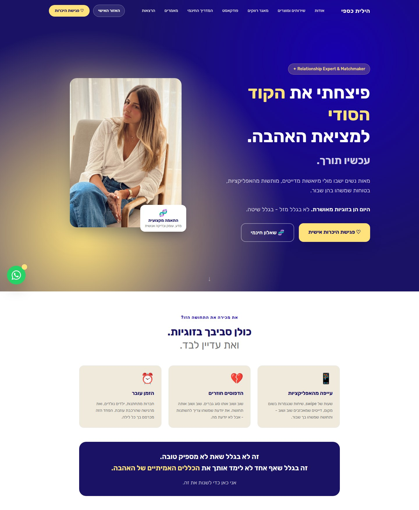

## 4.2 פלטת הליבה

| תפקיד | צבע | HEX | שימוש |
|---|---|---:|---|
| נייבי ראשי | כחול אינדיגו עמוק | `#191265` | Hero, ניווט, footer, טקסט ראשי וכפתור כהה |
| נייבי עמוק | כחול לילה | `#0F0B3D` | עומק, hover ומסמכים רשמיים |
| קרם | שנהב חם | `#F0EADC` | רקעי תוכן, אזורי נשימה וכרטיסים |
| קרם בהיר | אוף וייט | `#F8F4ED` | משטחים פנימיים ובלוקים רכים |
| זהב | צהוב שמפניה | `#FFE27C` | CTA, מספרים, אייקונים ורגעי החלטה |
| זהב כהה | חרדל מעודן | `#E6C84A` | hover והדגשה משנית |
| אפור ביניים | אפור חם | `#727272` | טקסט משני |
| אפור בהיר | קו עדין | `#E9E8E8` | גבולות, שדות והפרדות |
| סגול כחול | אינדיגו זוהר | `#1800AD` | halo, קישור והדגשה מוגבלת |

**כלל:** זהב מסמן פעולה, לא סטטוס. קרם מאפשר לנשום. נייבי הוא מקור האמון. אין להשתמש בכל הצבעים באותה עוצמה באותו מסך.

## 4.3 תמות קמפיין

| מערכת | פלטה | תחושה | שימוש |
|---|---|---|---|
| **ליבת המותג** | נייבי, קרם, זהב | סמכות, חום ובהירות | אתר, תוכן, מוצרים קבועים |
| **Database Plus** | יין, ורוד, קורל, זהב | אישי, פרימיום ואופטימי | עמוד מכירה והזמנות Plus |
| **Boost** | סגול, פוקסיה, זהב | דיגיטלי, אנונימי ואקטיבי | כרטיסים ואזור אישי Boost |
| **ט״ו באב** | ורוד, סגול כהה ולבבות | רומנטי, עונתי ודחוף | קמפיין בלבד |
| **ראש השנה** | אדמה, שמנת, חום ופרחים | בוגר, חגיגי ואופנתי | קמפיין חג בלבד |

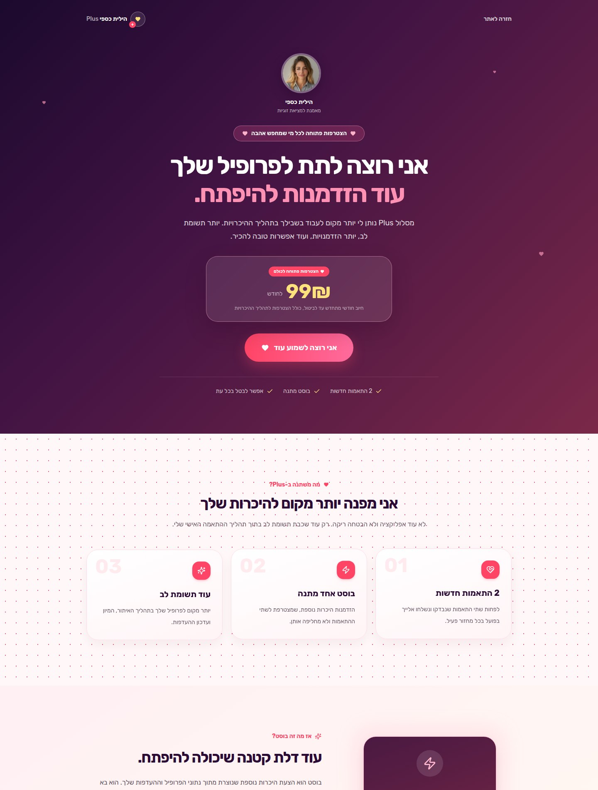

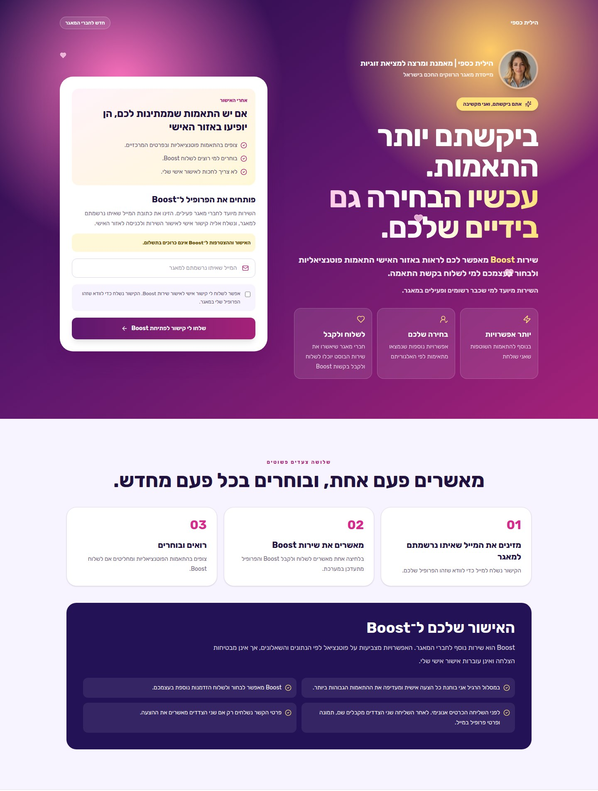

## 4.4 טיפוגרפיה

הגופן הראשי הוא **Rubik**. הוא עובד היטב בעברית, נשאר קריא במובייל ויכול לנוע בין תוכן רך לכותרת סמכותית. האתר טוען כיום משקלים 300–700, בעוד שחלק מהכותרות מבקשות 800–900. למעצבים מומלץ להשתמש ב-700 כל עוד המשקלים הכבדים אינם נטענים בפועל, או לטעון אותם באופן מסודר.

| תפקיד | מפרט מומלץ |
|---|---|
| Hero | Rubik 700, קצר, line-height צפוף, 40–64px בדיגיטל |
| כותרת מקטע | Rubik 700, 30–40px |
| כותרת כרטיס | Rubik 600–700, 18–24px |
| גוף | Rubik 400, 16–20px, מרווח שורות 1.5–1.7 |
| תג | Rubik 600, 12–14px, ריווח אותיות עדין |
| תנאים | Rubik 400, לא פחות מ-13px בדיגיטל |

אין לשלב serif חדש בליבה בלי החלטה מערכתית. אפשר להשתמש ב-serif בעטיפות קורס, ספר או מסמך פרימיום, אך לא ליצור זהות מקבילה שלא מתחברת לאתר.

## 4.5 פריסה ורכיבים

ה-Hero המומלץ הוא דו-טורי בדסקטופ וטורי במובייל. הטקסט קצר, הצילום אנכי, והקריאה לפעולה זהובה. כרטיסים בהירים הם קרם או לבן, עם גבול דק, רדיוס גדול וצל מאופק. כרטיס כהה הוא נייבי עם טקסט לבן וזהב.

| רכיב | החלטה |
|---|---|
| CTA ראשי | זהב על נייבי, Rubik 700, רדיוס 16–20px |
| CTA משני | נייבי או outline, ללא יותר מפעולה משנית אחת |
| כרטיס | קרם או לבן, border עדין, rounded 24px |
| שדה | גובה נדיב, border בהיר, focus נייבי ברור |
| FAQ | Accordion נקי, מקום לשקיפות ולגבולות |
| תג | pill קטן, מסר קצר בלבד |
| צילום | אנכי, חם, טבעי, מוקד פנים ברור |

## 4.6 צילום

הצילום צריך להראות את הילית כאדם שאפשר לסמוך עליו וכאישה בעלת טעם, לא כדמות מרוחקת. התאורה חמה, הרקע קרמי או מעץ, הלבוש נגיש ומוקפד, וההבעה טבעית. תמונות עם טלפון מתאימות למסרים על תקשורת, קהילה והיכרות. תמונות ישיבה מתאימות לליווי, עומק וסמכות. תמונות מחייכות מלאות מתאימות ל-Hero ולסושיאל.

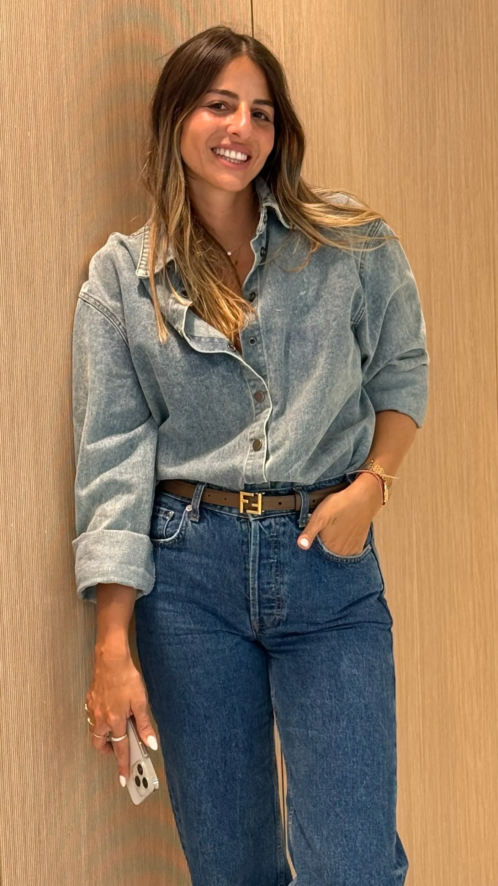

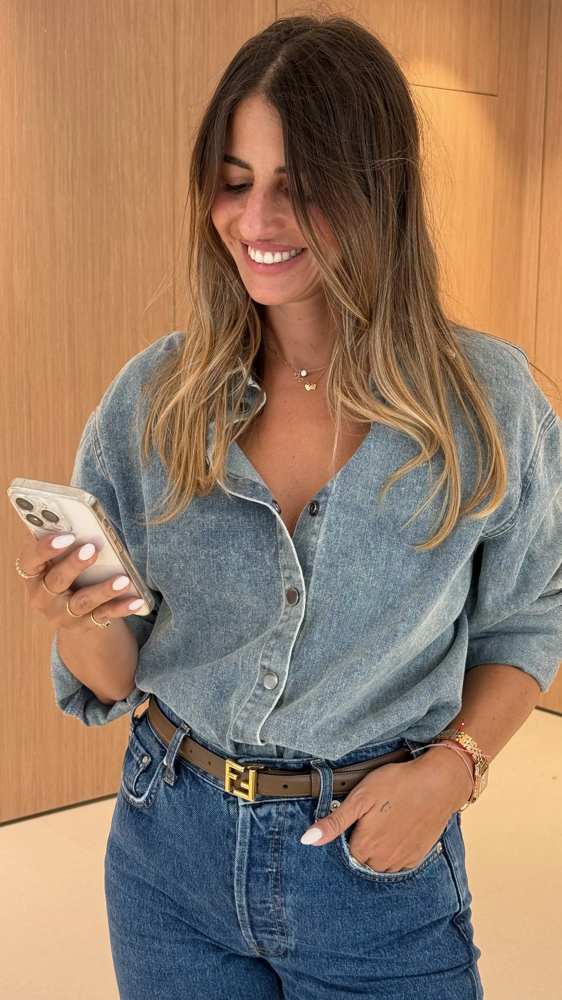

## 4.7 מה לא לעשות

אין להשתמש בתמונות גנריות של זוג מאושר כתחליף לסיפור. אין להעמיס לבבות, נצנצים או זהב על כל מסך. אין להפוך את הסגול והוורוד לצבעי ליבה. אין להשתמש בעשרות פונטים. אין להקטין תנאים מהותיים. אין להציג כרטיסי התאמה עם מידע מזהה בעיצוב, במצגת או בפרסום.

---

# 5. אקוסיסטם המוצרים

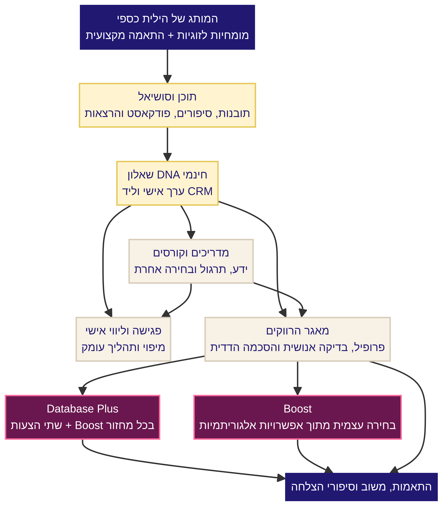

המערכת בנויה כרצף של **גילוי, תרגול, עומק, היכרות והרחבה**. אין מסלול חובה אחד. הקהל יכול להתחיל בשאלון, במאמר או בסושיאל, לעבור למדריך או לקורס, לבחור פגישה או ליווי, או להצטרף למאגר כאשר קיימת מוכנות להיכרות.

## 5.1 מחירון ותפקידים

| שכבה | מוצר | מחיר מתועד | סוג חיוב | תפקיד |
|---|---|---:|---|---|
| גילוי | שאלון DNA | חינם | אין חיוב | תוצאה אישית, ליד CRM והכוונה |
| גילוי | תוכן ומדריך חינמי | חינם | אין חיוב | אמון, חינוך והכנת קהל |
| תרגול | „לבחור נכון” | 149 ₪ | חד-פעמי | מדריך עבודה דיגיטלי |
| למידה | „המסע, מהפחד לבחירה” | 249 ₪ | חד-פעמי | קורס עומק וחוברת עבודה |
| בהירות | פגישה בודדת | 500 ₪ | חד-פעמי | מיפוי דפוסים וצעד הבא |
| ליווי | 8 פגישות | 2,960 ₪ | לפי תנאי המסלול | תהליך 1:1 וגישה למאגר |
| ליווי | 12 פגישות | 4,200 ₪ | לפי תנאי המסלול | תהליך 1:1 רחב וגישה למאגר |
| היכרות | מאגר הרווקים והרווקות | 299 ₪ | חד-פעמי | פרופיל, שאלון והתאמות מקצועיות |
| הרחבה | Database Plus | 99 ₪ לחודש | מתחדש עד ביטול | שתי הצעות ו-Boost בכל מחזור |
| בחירה עצמית | Boost | הרשמה חינם, 19.90 ₪ לשליחה | חד-פעמי לכל שליחה | בחירה מתוך אפשרויות אנונימיות |

המחירים נכונים לפי הקוד והעמודים שנבדקו. לפני קמפיין יש לאמת זמינות, תנאים וסליקה. המחיר 499 ₪ שמופיע כמחיר ייחוס למאגר אינו מתועד כמחיר שוטף שנגבה בעבר; אין להציגו כ״מחיר היסטורי״ ללא אימות Grow או חשבוניות.[4][8]

## 5.2 שאלון DNA

**תפקיד:** שער הכניסה המרכזי של הקהל הקר. הוא נותן ערך לפני המכירה, יוצר ליד ומתחיל מערכת יחסים עם המותג.

**הבטחה:** תוצאה אישית שנותנת שם לדפוס קשר. לא אבחון ולא חיזוי.

**מבנה:** כ-20 היגדים, תוצאה מתוך ארבעה טיפוסים, מסירת פרטים והסכמה, ואז תוצאה ומסע אימייל.

**עמוד:** [hilitcaspi.com/dna-quiz](https://hilitcaspi.com/dna-quiz)

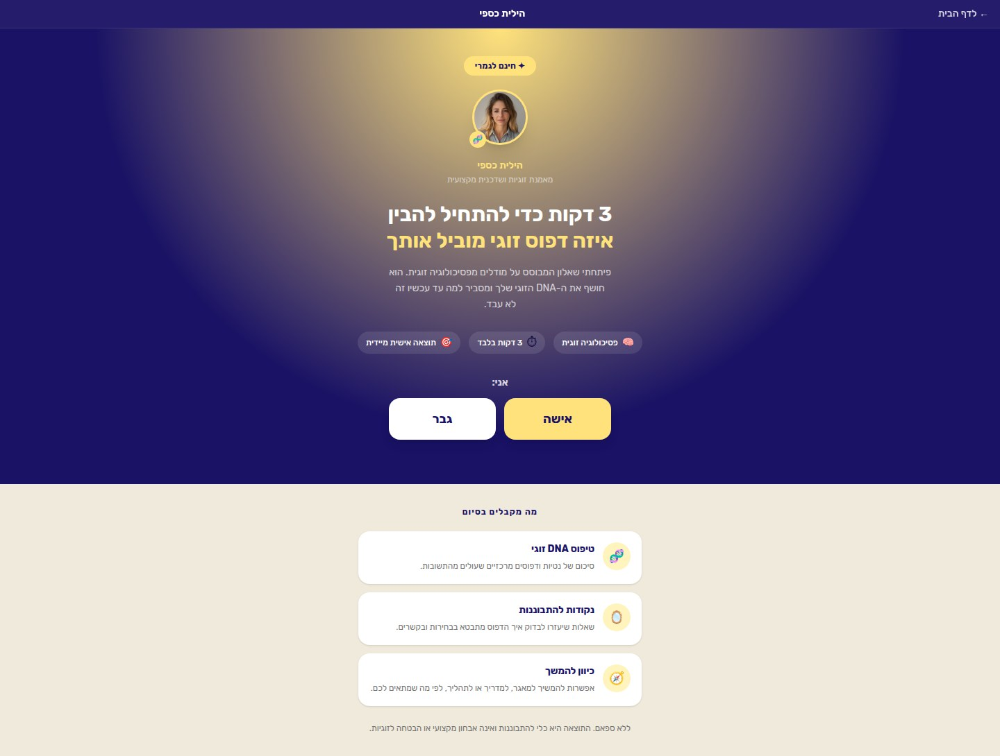

## 5.3 המדריך „לבחור נכון”

**מחיר:** 149 ₪ חד-פעמי.

**תפקיד:** מוצר כניסה בתשלום שממיר תובנה לתרגול. הוא כולל שאלון דפוס, תרגילים ושאלות לעבודה עצמית.

**מסר:** „לא עוד מדריך קריאה. מדריך עבודה.”

**עמוד:** [hilitcaspi.com/guide](https://hilitcaspi.com/guide)

## 5.4 הקורס „המסע”

**מחיר:** 249 ₪ חד-פעמי.

**תפקיד:** מוצר עומק דיגיטלי, עם מודולים, חוברת עבודה ומפה אישית. הוא צריך להיות ממוצב כקורס הדגל של השיטה, לא כאוסף סרטונים.

**עמוד:** [hilitcaspi.com/course](https://hilitcaspi.com/course)

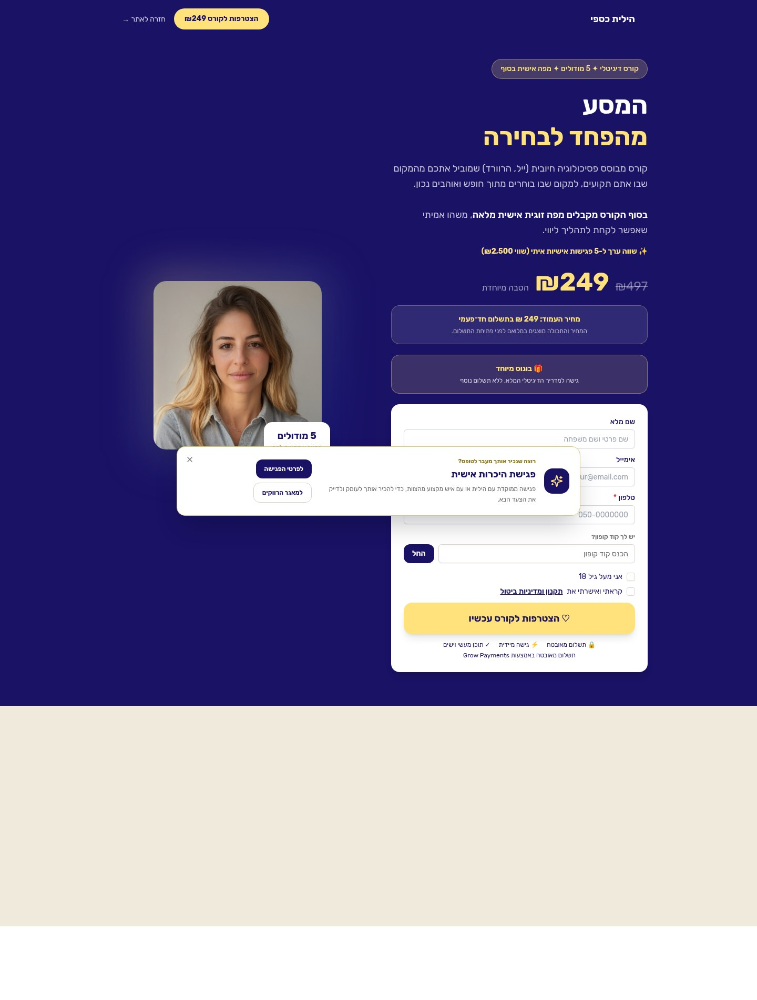

## 5.5 פגישה וליווי

**פגישה:** 500 ₪ ל-60 דקות. תפקידה למפות את המצב, לזהות דפוס ולהגדיר את הצעד הבא. היא יכולה להוביל לליווי או למאגר, אך אינה שיחת מכירה בתחפושת.

**ליווי:** 2,960 ₪ ל-8 פגישות או 4,200 ₪ ל-12 פגישות. זהו מוצר הפרימיום של עבודה 1:1. המסר צריך להדגיש שינוי בדרך הבחירה והפעולה, לא תלות במלווה.

**עמודים:** [פגישה](https://hilitcaspi.com/single-session), [ליווי](https://hilitcaspi.com/coaching)

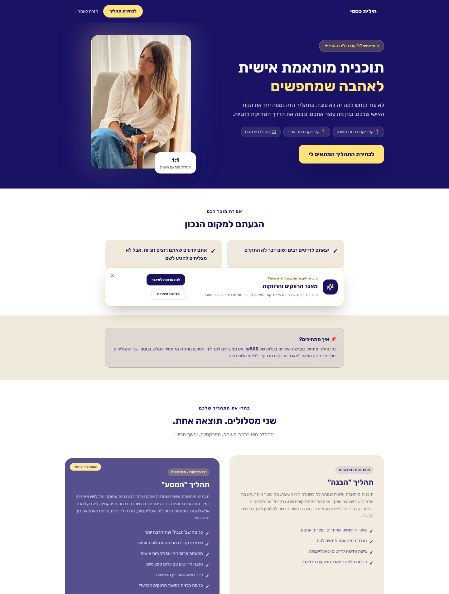

## 5.6 המאגר

**מחיר:** 299 ₪ חד-פעמי.

**תפקיד:** מוצר הליבה של ההיכרות. הוא אינו אפליקציה. פרופיל עומק, DNA, שאלון מדעי והעדפות מסייעים לזהות אפשרויות. בהתאמה רגילה הילית בודקת את ההצעה, ושני הצדדים מאשרים לפני חשיפת פרטי קשר.

**מסר:** „לא צריך עוד מאה פרופילים. צריך הזדמנות אחת שיש בה הקשר.”

**גבול:** אין התחייבות למספר הצעות, תדירות, דייט או זוגיות.

**עמודים:** [דף המאגר](https://hilitcaspi.com/database), [טופס ההצטרפות](https://hilitcaspi.com/join)

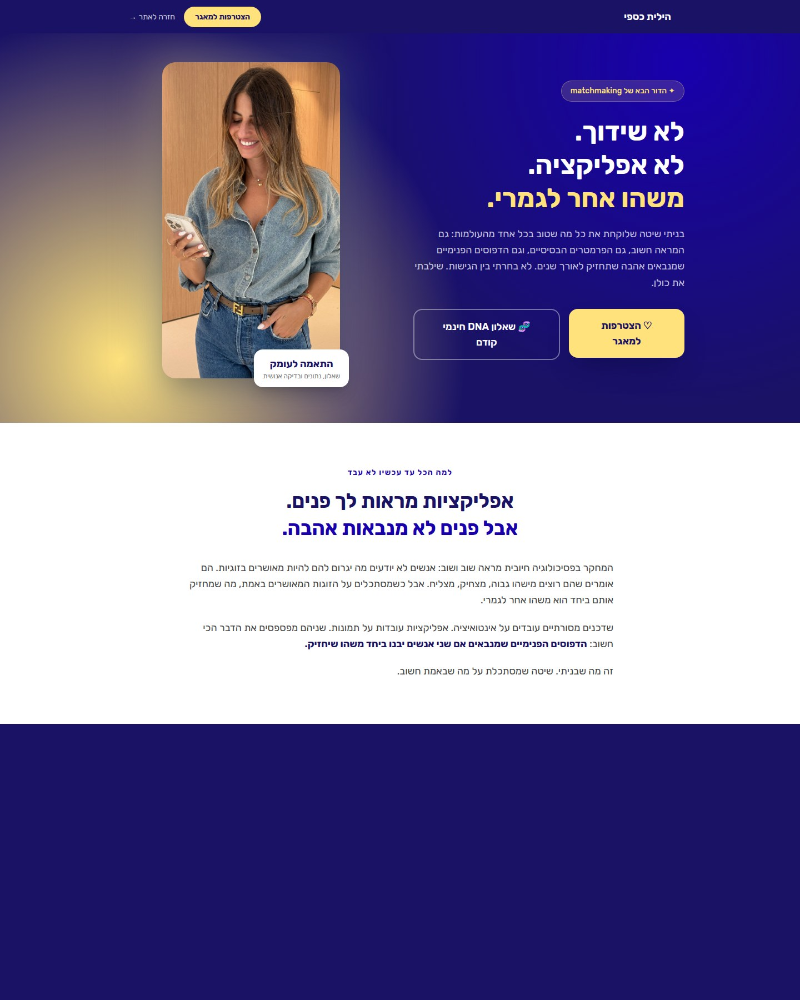

> **סדר ההצטרפות המומלץ להצגה בכל העמודים:** פרופיל → שאלון DNA → תשלום → שאלון מדעי → הפעלה והתאמות.

## 5.7 Database Plus

**מחיר:** 99 ₪ לחודש, חיוב מתחדש עד ביטול.

**הבטחה מדידה:** לפחות שתי הצעות חדשות שנבדקו ונשלחו בפועל בכל מחזור חיוב אישי. Boost אחד נוסף כלול ואינו נספר במכסה.

**מסר:** „יותר עבודה יזומה סביב הפרופיל.”

**גבול:** לא ליווי אישי מלא, לא זמינות 24/7 ולא הבטחת אישור הדדי או זוגיות. ליד כל אזכור Boost יש לציין שהוא אלגוריתמי ואינו נבדק ידנית.

**עמוד:** [hilitcaspi.com/database-plus](https://hilitcaspi.com/database-plus)

## 5.8 Boost

**מחיר:** ההצטרפות לשירות חינם. שליחת Boost עצמאי עולה 19.90 ₪. Boost אחד נכלל בכל מחזור Plus.

**תפקיד:** לתת יותר בחירה לחברי מאגר פעילים, בלי להפוך את המערכת ל-feed. מוצגות עד שש אפשרויות אנונימיות עם ציון ונימוקים. לאחר בחירה שני הצדדים מקבלים פרופיל להחלטה, ופרטי קשר נחשפים רק לאחר שני אישורים.

**גילוי חובה:** ההצעה אלגוריתמית ולא נבדקה ידנית בידי הילית.

**עמודים:** [הצטרפות ל-Boost](https://hilitcaspi.com/match-boost), [Boost Now](https://hilitcaspi.com/boost-now)

---

# 6. משפך שאלון DNA עד רכישת המאגר

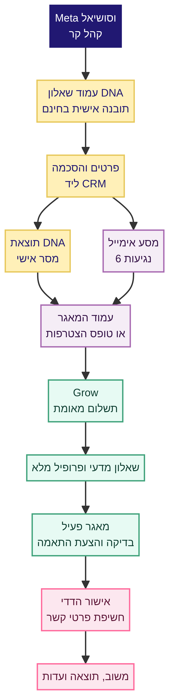

## 6.1 המסע

1. קהל קר פוגש תוכן או מודעה ומגיע לשאלון DNA.
2. השאלון נותן תחושת גילוי עצמי ותוצאה אישית.
3. לפני הצגת התוצאה נשמרים פרטי קשר והסכמה, ונוצר או מתעדכן ליד CRM.
4. תוצאת DNA ומסע של שש נגיעות במייל מעמיקים את ההבנה ומציגים אפשרויות המשך.
5. מי שמוכן להיכרות עובר לעמוד המאגר או לטופס ההצטרפות.
6. פרופיל, DNA ותשלום מובילים לעסקת Grow מאומתת.
7. לאחר תשלום נדרש שאלון מדעי והשלמת הפרופיל.
8. הפרופיל הופך פעיל ונכנס לתהליך התאמות.
9. התאמה שנשלחת דורשת אישור של שני הצדדים לפני פרטי קשר.
10. משוב וסיפור הצלחה חוזרים למערכת האמון והשיווק, בכפוף להסכמה.

## 6.2 התפקיד של המייל

המייל **מסייע** למסע, אך אינו מקור מכירה בלעדי. אדם יכול לפגוש מודעה, להשלים DNA, לקרוא מייל, לחזור ישירות לאתר ולרכוש. לכן מדידה נכונה מפרידה בין מקור ראשון, מגע אחרון, מייל מסייע ורכישת Grow מאומתת.

## 6.3 מקור האמת

**Grow הוא מקור האמת לרכישה ולהכנסה.** Meta, Pixel, דף תודה, אירוע Purchase ונתוני פתיחת מייל הם שכבות מדידה משלימות. אין להציג התחלת תשלום כרכישה, ואין להשתמש בהכנסה שמיוחסת על ידי Meta כספר הכנסות.

## 6.4 UTM מומלץ

| שדה | כלל |
|---|---|
| `utm_source` | `meta`, `instagram`, `facebook`, `email`, `organic` |
| `utm_medium` | `paid_social`, `organic_social`, `email`, `referral` |
| `utm_campaign` | שם אחד עקבי לכל קמפיין, באנגלית ובאותיות קטנות |
| `utm_content` | מזהה קריאייטיב או זווית מסר |
| `utm_term` | קהל או ad set, רק כאשר הוא מוסיף מידע |

דוגמה: `utm_source=meta&utm_medium=paid_social&utm_campaign=lead_cold_dna_sep26&utm_content=pattern_video_01`

---

# 7. מערכת תוכן וסושיאל

## 7.1 תפקיד הסושיאל

הסושיאל אינו קטלוג מוצרים. הוא המקום שבו הקהל מזהה את עצמו, מקבל הבחנה חדשה, מתחיל לסמוך על הילית ומבין שיש דרך אחרת. לכל תוכן צריך להיות אחד משלושה תפקידים: **להבין דפוס, לבחור אחרת, או להיפתח להיכרות מקצועית.**

## 7.2 עמודי תוכן

| עמוד | תפקיד | יחס מומלץ |
|---|---|---:|
| דפוסים ומדע האהבה | סמכות, הזדהות ושמירות | 35% |
| דייטינג ובחירה מעשית | כלים, תגובות ושיתופים | 25% |
| סיפורי הצלחה ועדויות | הוכחה חברתית ואמון | 15% |
| מאחורי הקלעים של ההתאמות | בידול המאגר והילית | 10% |
| הילית כאדם וכמומחית | חיבור אישי ואוטוריטה | 10% |
| הצעה ומכירה | הנעה למוצר או מאגר | 5% בשוטף, יותר בהשקה |

## 7.3 פורמטים

| פורמט | מבנה |
|---|---|
| Reel תובנה | Hook קצר, דוגמה מהחיים, הבחנה, שאלה או CTA |
| קרוסלה | טענה, 3–5 שקפים של פירוק, סיכום וכלי אחד |
| Story | שאלה או מתח, תגובה אישית, poll, קישור |
| עדות | משפט אנושי, ההקשר, השינוי, הסכמה ותמונה אם מאושרת |
| Q&A | שאלה אמיתית, תשובה ישירה, גבול, צעד הבא |
| השקה | בעיה, למה עכשיו, מה מקבלים, מחיר, תנאים ו-CTA |

## 7.4 נראות סושיאל

יש להשתמש בנייבי, קרם וזהב כרקע קבוע לזיהוי. צילום של הילית צריך להופיע בתדירות גבוהה, אך לא בכל פוסט. שקפים טקסטואליים יכולים להשתמש בכותרת גדולה בצד ימין, קו זהב קטן, הרבה שטח ריק ולוגו או שם קטן. בתוכן חם אפשר להשתמש ברקע צילום, חום עץ וג׳ינס. תמות ורודות או סגולות שמורות להשקה מסוימת.

## 7.5 מסרי CTA לפי שלב

| שלב | CTA |
|---|---|
| קהל קר | „אפשר להתחיל בשאלון החינמי.” |
| קהל שמזהה דפוס | „שמירה לפעם הבאה שהתחושה הזו מגיעה.” |
| קהל חם | „המדריך הופך את ההבחנה הזו לתרגול.” |
| מוכן להיכרות | „אפשר לבדוק אם המאגר מתאים לך עכשיו.” |
| חברי מאגר | „האזור האישי מרכז את הפרופיל, ההתאמות ו-Boost.” |

---

# 8. קמפיין ט״ו באב, קייס סטאדי

## 8.1 ההצעה

הקמפיין ההיסטורי מכר חבילה של **הצטרפות למאגר + המדריך „לבחור נכון”** ב-349 ₪ חד-פעמי, ללא מנוי. המחיר המוצג לפני המבצע היה 748 ₪ בעמוד, בעוד שבחלק מהמודעות הופיע 749 ₪. בהפעלה חוזרת חייבים לאחד את המחיר.

ההיגיון המצוין של החבילה היה: **„המאגר מביא את ההזדמנויות. המדריך עוזר לעשות איתן את הדבר הנכון.”** זהו מודל חבילה שכדאי לשמר, משום שהוא מחבר מוצר פעולה למוצר היכרות ולא מציג הנחה בלבד.

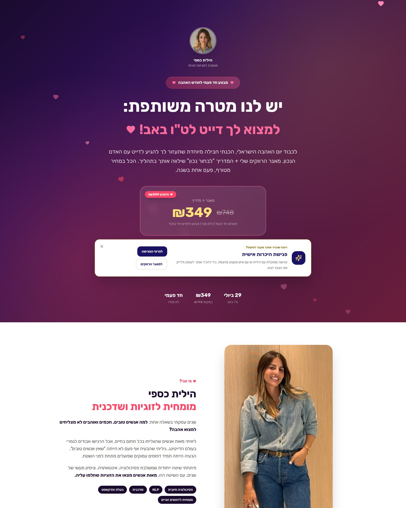

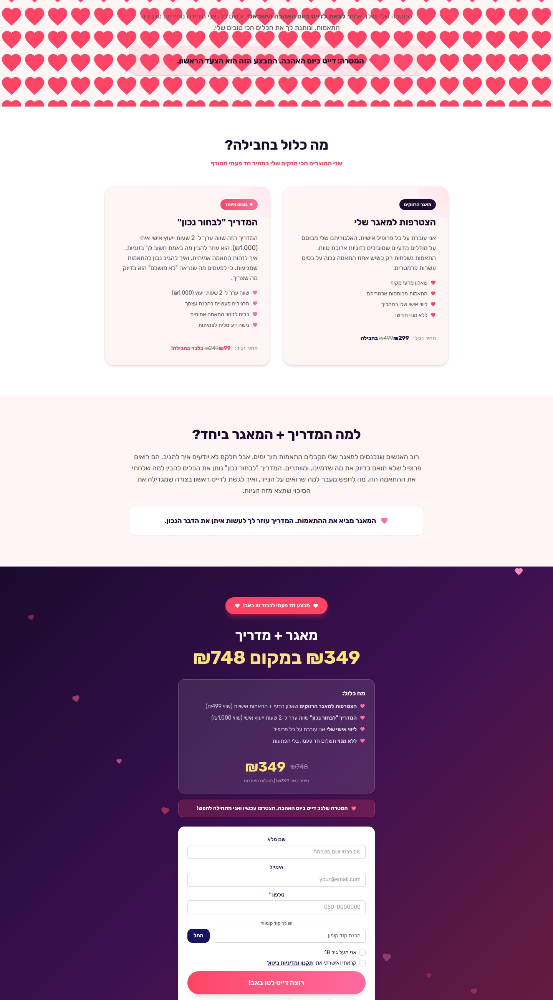

## 8.2 מבנה המדיה

| קמפיין | תפקיד | תקציב היסטורי |
|---|---|---:|
| קהל קר רחב | רכישה חדשה | 100 ₪ ליום |
| רימרקטינג | מבקרים ומתעניינים שלא רכשו | 100 ₪ ליום |
| סקרסיטי | שלושת הימים האחרונים | 50 ₪ ליום |

## 8.3 מודעות ומסרים

הקמפיין השתמש בוידאו היכרות ומומחיות, תמונות Headshot, רימרקטינג מפורש ומודעות סקרסיטי. המסרים החזקים היו: חלופה לאפליקציות, שיטה ובדיקה מקצועית, חבילה שמשלבת הבנה והיכרות, מחיר חד-פעמי, ותאריך ברור.

הכיוון המוביל בנפח היה `Cold_Photo_2Headshot`, וידאו בקהל קר. הכיוון היעיל ביותר על נפח קטן יותר היה `Cold_Photo_2retargeting`, קריאייטיב סטטי עם הצעה מפורשת. אין להסיק מכך ניסוי מבוקר, אך כן לשמר את השילוב בין וידאו סמכות לקהל קר לבין הצעה ברורה ברימרקטינג.[7]

## 8.4 ביצועים היסטוריים ב-Meta

בחלון 1 ביולי עד 10 באוגוסט 2026 שלושת הקמפיינים רשמו יחד הוצאה של 3,862.81 ₪, 110 אירועי Purchase שיוחסו על ידי Meta, CPA של 35.12 ₪ ו-ROAS של 8.77. אלה נתוני ייחוס של Meta, לא הכנסה חשבונאית. קיימים פערים מול נתוני האתר והתשלומים, ולכן לפני שימוש עסקי יש לבצע פיוס מול Grow, החזרים וביטולים.[7]

## 8.5 שער הפעלה מחדש

קמפיין ט״ו באב נחשב נכס מורשת. לפני הפעלה מחדש נדרש לאשר תאריך, יכולת שירות, מחיר, תנאי חבילה, אספקה, קופה, קופון, עמוד תודה ומקור אמת למדידה. יש להחליף הבטחה כמו „דייט עד ט״ו באב” בהבטחה שניתן לקיים בפועל.

---

# 9. רפרנסים לעמודים שנאהבו

## 9.1 עמוד הבית

עמוד הבית הוא רפרנס לליבה: Hero נייבי, צילום אנכי, זהב לפעולה, קרם לתוכן ומבנה של סמכות, שיטה ומוצרים. הוא המקום שמגדיר את המותג, ולכן קמפיינים צריכים לחזור אליו לפחות דרך צבע, צילום או טיפוגרפיה.

**קישור:** [hilitcaspi.com](https://hilitcaspi.com/)

## 9.2 עמוד המאגר

רפרנס למבנה מוצר: כאב ברור, הבטחה צנועה, הסבר תהליך, פרטיות, שאלות ותשובות ו-CTA. יש ליישר בו מסרים על אלגוריתם ובדיקה אנושית.

**קישור:** [hilitcaspi.com/database](https://hilitcaspi.com/database)

## 9.3 Database Plus

רפרנס לקמפיין פרימיום אישי. עיצוב ורוד-יין, לבבות עדינים, כרטיסים רכים ותחושה של הזמנה אישית. צריך לשמר את הקונקרטיות: 99 ₪ לחודש, שתי הצעות ו-Boost.

**קישור:** [hilitcaspi.com/database-plus](https://hilitcaspi.com/database-plus)

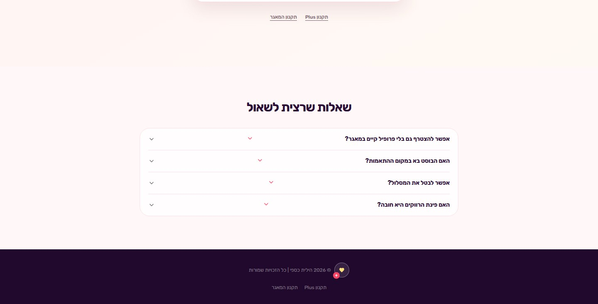

## 9.4 Boost

רפרנס למוצר דיגיטלי עם פרטיות. צבעים סגולים, אנונימיות וכרטיסים שמרגישים כמו כלי החלטה ולא כמו אפליקציית swipe.

**קישורים:** [Match Boost](https://hilitcaspi.com/match-boost), [Boost Now](https://hilitcaspi.com/boost-now)

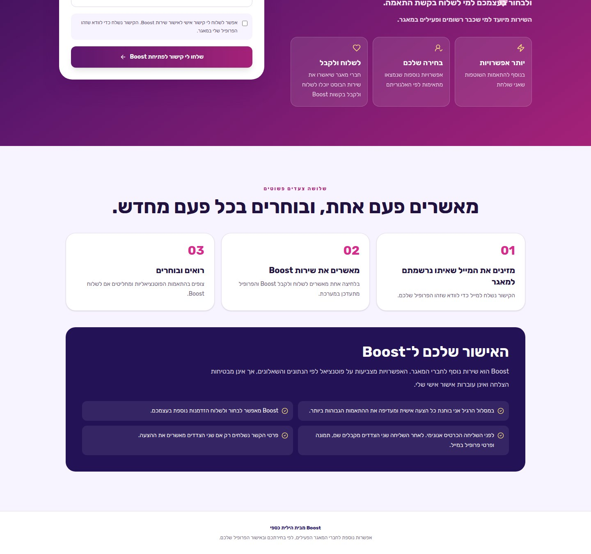

## 9.5 ט״ו באב

רפרנס לקמפיין עונתי חזק: צבע מובחן, הצעה משולבת, דדליין, מחיר ומסע קר-חם. יש לשמר את המבנה, לא להעתיק את ההבטחה או התאריך.

**קישור מורשת:** [hilitcaspi.com/tu-bav](https://hilitcaspi.com/tu-bav)

## 9.6 ראש השנה

רפרנס לתמה בוגרת, אופנתית וחמה. אדמה, שמנת, חום ופרחים יוצרים חגיגיות שלא נראית ילדותית. התמה אינה מחליפה את צבעי הליבה.

**קישור עונתי:** [hilitcaspi.com/new-year-love](https://hilitcaspi.com/new-year-love)

---

# 10. רפרנסים בינלאומיים

## Esther Perel

[האתר של Esther Perel](https://www.estherperel.com/) הוא רפרנס למותג מומחית שנמצא במרכז אקוסיסטם של תוכן, פודקאסט, קהילה ומוצרים. הסמכות נבנית דרך עומק וסיפורים אמיתיים, לא דרך הבטחות אגרסיביות.[9]

**מה לקחת:** מומחית אחת במרכז, מערכת תוכן עשירה, עיצוב עריכתי, כותרות קצרות וחיבור בין עומק מקצועי לאנושיות.

## The School of Life

[The School of Life](https://www.theschooloflife.com/) הוא רפרנס להפיכת ידע רגשי למערכת של מאמרים, סרטונים, פודקאסט, טיפול, קורסים, קלפים וקהילה.[10]

**מה לקחת:** ארכיטקטורת מוצרים ברורה, תוכן חינמי ככניסה, אסתטיקה אינטלקטואלית נגישה, וכל מוצר מחובר לאותה הבטחת על.

## Match by COLLINS

[מיתוג Match](https://wearecollins.com/case-studies/match/) נבנה כדי להיות „המבוגר בחדר” בעולם של אפליקציות מהירות ומשחקיות. הוא מדגיש עומק על פני מהירות, איכות על פני כמות, טיפוגרפיה בוגרת, צבעים רכים ואווירה של אירוח ודיסקרטיות.[11]

**מה לקחת:** רומנטיקה בוגרת, לא קלישאתית; שירות שמרגיש כמו concierge; צבעים אינטימיים; טכנולוגיה שנשארת כמעט בלתי נראית.

---

# 11. נכסים, קישורים וכתובות

## 11.1 נכסי ליבה בישראל

| נכס | URL | תפקיד |
|---|---|---|
| אתר | https://hilitcaspi.com/ | בית המותג |
| שאלון DNA | https://hilitcaspi.com/dna-quiz | גילוי וליד |
| מאגר | https://hilitcaspi.com/database | דף מכירה מרכזי |
| הצטרפות | https://hilitcaspi.com/join | פרופיל ותשלום |
| מדריך | https://hilitcaspi.com/guide | מוצר כניסה |
| קורס | https://hilitcaspi.com/course | מוצר עומק |
| פגישה | https://hilitcaspi.com/single-session | שירות 1:1 |
| ליווי | https://hilitcaspi.com/coaching | מוצר פרימיום |
| Plus | https://hilitcaspi.com/database-plus | מנוי המשך |
| Boost | https://hilitcaspi.com/match-boost | הצטרפות לשירות |
| Boost Now | https://hilitcaspi.com/boost-now | הפעלת שליחה |
| בלוג | https://hilitcaspi.com/blog | תוכן ו-SEO |
| הרצאות | https://hilitcaspi.com/speaking | B2B |
| סיפורי הצלחה | https://hilitcaspi.com/blog/sipurei-hatzlacha | הוכחה חברתית |

## 11.2 סושיאל וקהילה

| ערוץ | URL |
|---|---|
| Instagram ישראל | https://www.instagram.com/hilitcaspi_relationship/ |
| Instagram בינלאומי | https://www.instagram.com/match.by.hilit/ |
| Facebook | https://www.facebook.com/hilitcaspirelationship |
| TikTok | https://www.tiktok.com/@hilitcaspi_relationship |
| Substack | https://substack.com/@hilitcaspi |
| WhatsApp עסקי | https://wa.me/972552442334 |
| Spotify | https://open.spotify.com/episode/7l1SSASi2TCDGs09gixcKc |

## 11.3 המותג הבינלאומי

המותג הבינלאומי פועל תחת [Match by Hilit](https://matchbyhilit.com/). יש להעדיף את הדומיין הזה על פני נתיבי `/en` הישנים. לפני רכישת מדיה יש ליישב את הסתירה בין מחיר מאגר של $99 בדף המכירה לבין $149 שמופיע בחלק ממסע ה-DNA האנגלי.[8]

## 11.4 נכסים עונתיים או מורשת

| נכס | URL | סטטוס |
|---|---|---|
| ט״ו באב | https://hilitcaspi.com/tu-bav | מורשת, לא לקידום בלי אישור |
| ראש השנה | https://hilitcaspi.com/new-year-love | עונתי, לבדוק תוקף וקופה |
| ספטמבר | https://hilitcaspi.com/september | עונתי, לבדוק מחירים |
| Live | https://hilitcaspi.com/live | תאריך עבר, לא לקידום |

---

# 12. הנחיות למעצב ולסטודיו

## 12.1 עקרונות חובה

כל נכס צריך להרגיש כמו אותו מותג גם כאשר הוא שייך לתמה אחרת. כדי להשיג זאת שומרים לפחות שלושה מתוך חמשת העוגנים: Rubik, צילום של הילית, נייבי, זהב, שפה קצרה וישירה. קמפיין רשאי לשנות צבעוניות, אך לא את האופי, הגבולות או איכות ההיררכיה.

## 12.2 תבנית לעמוד מכירה

1. Hero עם כאב או רצון אחד, הבטחה צנועה ו-CTA.
2. למה הדרך הקיימת אינה עובדת.
3. ההבחנה הייחודית של הילית.
4. מה המוצר כולל, במונחים קונקרטיים.
5. איך התהליך עובד, ב-3–5 שלבים.
6. למי מתאים ולמי פחות.
7. מחיר, סוג חיוב ותנאים.
8. הוכחה חברתית מאושרת.
9. שאלות ותשובות עם גבולות ההבטחה.
10. CTA מסכם אחד.

## 12.3 תבנית למודעת סושיאל

**Hook:** שאלה, אמת מפתיעה או מצב מוכר.

**Body:** הבחנה אחת, בלי הרצאה שלמה.

**Proof:** ניסיון, תהליך, דוגמה או שאלה שממחישה.

**CTA:** פעולה אחת בלבד.

## 12.4 תבנית לסטורי

**סטורי 1:** מתח או שאלה.

**סטורי 2:** ההבחנה של הילית.

**סטורי 3:** כלי קטן או poll.

**סטורי 4:** מעבר לשאלון, מוצר או מאגר.

## 12.5 פרטיות

אין להציג נתונים אישיים בצילומי מסך. אין להשתמש בעדות, תמונה או וידאו ללא הסכמה לערוץ המדויק. אין להכניס URL עם token, email או קישור אישי לקובץ עיצוב. בכרטיסי Boost שומרים על אנונימיות לפני שליחה.

---

# 13. פערים שצריך לפתור לפני עיצוב מחדש או קמפיין

| עדיפות | פער | החלטה נדרשת |
|---|---|---|
| גבוהה | אלגוריתם מול בדיקה אנושית | לאמץ: „נתונים ככלי עזר; הילית בודקת התאמות רגילות.” Boost מסומן כאלגוריתמי |
| גבוהה | תקופת פעילות במאגר | להכריע בין 12 חודשים לבין ללא תאריך תפוגה ולעדכן הכול |
| גבוהה | סדר ההצטרפות | לאחד לפרופיל, DNA, תשלום, שאלון מדעי, הפעלה |
| גבוהה | מחיר ייחוס 499 ₪ | לאמת מול Grow לפני הצגה כמחיר קודם |
| גבוהה | טענות מדעיות | לצרף מקור או לרכך לשפת עקרונות וכלי עזר |
| גבוהה | שפת „סינון” | להחליף ב„בדיקת פרופיל והתאמה לתנאי השירות” |
| בינונית | תקנון Plus | להשלים בדיקה משפטית |
| בינונית | כשל חיוב Plus | להגדיר תהליך לפני הבטחת אוטומציה |
| בינונית | מחיר Boost | לאחד 19.90 מול מופעים של 19.99 |
| בינונית | תזמון נטישת עגלה | ליישר 48 מול 72 שעות |
| בינונית | שני Meta Pixels | לבדוק כפילויות ו-CAPI ב-Events Manager |
| בינונית | עמודים עונתיים חיים | לסגור, להפנות או לסמן שהקמפיין הסתיים |
| בינונית | כפילות URLs | להגדיר canonical למאגר, קורס והאתר הבינלאומי |

---

# 14. בריף של עמוד אחד

**מי אנחנו:** מותג ישראלי של מומחיות לזוגיות והתאמה מקצועית, בהובלת הילית כספי.

**למי:** אנשים רציניים שמחפשים קשר ונמאס להם לחפש באותה דרך.

**מה אנחנו מבטיחים:** בהירות, כלים, תרגול ותהליך היכרות מקצועי ומכבד.

**מה אנחנו לא מבטיחים:** זוגיות, דייט, מספר התאמות או זמן לתוצאה.

**איך אנחנו נשמעים:** חמים, ישירים, חכמים, לא שיפוטיים ולא מאבחנים.

**איך אנחנו נראים:** נייבי, קרם וזהב; Rubik; צילום אישי וחם; הרבה שטח נשימה; רדיוסים גדולים; תנועה עדינה.

**למה אנחנו שונים:** לא גלילה ולא אלגוריתם לבדו. הבנת דפוסים, נתונים ככלי עזר ושיקול דעת אנושי.

**מוצרי הליבה:** DNA חינמי, מדריך, קורס, פגישה, ליווי, מאגר, Plus ו-Boost.

**הפעולה המרכזית לקהל קר:** שאלון DNA.

**הפעולה המרכזית לקהל שמוכן להיכרות:** בדיקת התאמה למאגר והצטרפות.

---

# מקורות

[1]: brand-book-research/01-brand.md "תשתית מותג"
[2]: brand-book-research/02-visual.md "מערכת חזותית"
[3]: brand-book-research/03-dna-funnel.md "מפת משפך DNA"
[4]: brand-book-research/04-database.md "מאגר הרווקים והרווקות"
[5]: brand-book-research/05-boost.md "Boost"
[6]: brand-book-research/06-plus.md "Database Plus"
[7]: brand-book-research/07-tu-bav.md "קמפיין טו באב"
[8]: brand-book-research/08-assets-products.md "מפת נכסים ומוצרים"
[9]: https://www.estherperel.com/ "Esther Perel"
[10]: https://www.theschooloflife.com/ "The School of Life"
[11]: https://wearecollins.com/case-studies/match/ "Match by COLLINS"
