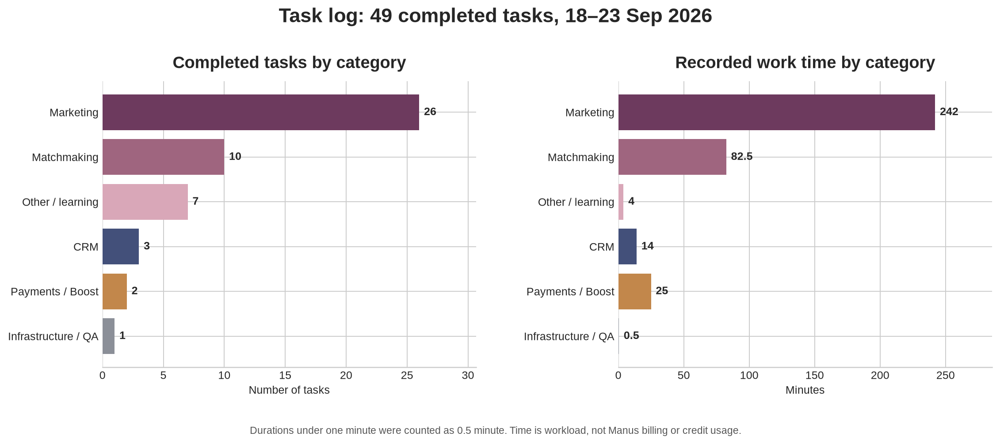

# לאן הולכים הקרדיטים של Manus — ותוכנית מעבר לביצוע עצמי

**תאריך:** 23 בספטמבר 2026  
**בסיס הניתוח:** 49 משימות שהושלמו ביומן בין 18–23 בספטמבר 2026, עם 368 דקות עבודה מתועדות.[1]

## מסקנה קצרה

רוב העבודה בתקופה המתועדת קשורה לשיווק: **26 מתוך 49 משימות, ו־242 מתוך 368 דקות**. זהו 53% מהבקשות ו־66% מזמן העבודה. בתוך השיווק החלוקה כמעט שווה: כ־126 דקות הוקדשו למדידה, קמפיינים ודשבורדים, וכ־116 דקות לתוכן, קורסים ועיצוב.

תחום ההתאמות נמצא במקום השני עם **10 משימות ו־82.5 דקות**. תשלומים ו־Boost הופיעו רק פעמיים, אבל צרכו **25 דקות** בגלל הצורך להצליב כמה מערכות ולהימנע מטעות כספית.

> **חשוב:** אין ביומן אפילו משימה אחת עם נתון מאומת של קרדיטים, טוקנים או עלות כספית. לכן אי אפשר לחשב כמה כסף עלה כל סוג משימה. אפשר לזהות מה יוצר עומס עבודה וסביר שצורך יותר משאבים, אבל לא להציג זאת כחיוב אמיתי. לבירור צריכת הקרדיטים והחיוב בפועל צריך לפנות למרכז העזרה של Manus.[6]

## מה את מבקשת הכי הרבה

| דירוג | סוג הבקשה | היקף ביומן | המשמעות |
|---|---|---:|---|
| 1 | שיווק, תוכן, קורסים וניתוח קמפיינים | 26 משימות, 242 דקות | זהו מוקד הביקוש והעומס הגדול ביותר. חלק מהעבודה יצירתי, וחלק הוא איסוף נתונים שחוזר על עצמו. |
| 2 | תפעול התאמות | 10 משימות, 82.5 דקות | שליחה, שליחה חוזרת, שחרור, בדיקת מסירה, חריגי גובה ומשוב. רוב הפעולות יכולות להפוך למסלול בטוח בדשבורד. |
| 3 | תרגום ובקשות קצרות אחרות | 7 משימות, 4 דקות | הרבה בקשות, אבל כמעט ללא עומס. זה אינו המקום הראשון לחיסכון. |
| 4 | CRM ופרופילים | 3 משימות, 14 דקות | מעט משימות, אך כל אחת נוגעת בכמה רשומות ובהרשאות רגישות. מתאים מאוד לאשף פעולה עצמי. |
| 5 | תשלומים ו־Boost | 2 משימות, 25 דקות | תדירות נמוכה אך עומס וסיכון גבוהים. צריך מסך פיוס, לא אוטומציה כספית מלאה. |
| 6 | תשתיות ו־QA | משימה אחת סווגה ישירות | בפועל בדיקות, פרסומים ותיעוד משולבים כמעט בכל משימת קוד ולכן הסיווג הישיר ממעיט בהיקפם. |

## מה כנראה צורך הכי הרבה משאבים

### 1. יצירה גדולה מאפס

המשימה הארוכה ביותר הייתה בניית קורס הדגל, שנמשכה 55 דקות וכללה מחקר, כתיבה ארוכה, חוברת עבודה, השקה ובקרת מקורות. משימות כאלה דורשות הרבה טקסט, שיקול דעת, לעיתים כמה סוכני מחקר ובדיקות רבות. הן אינן מתאימות להפיכה לכפתור מלא.

### 2. פיתוח דשבורד וניתוח קמפיינים רב־מערכתי

ארגון דשבורד הקמפיינים נמשך 50 דקות. הוא דרש חיבור של Meta, CRM, Brevo ו־Grow, שינוי שרת וממשק, בדיקות, build ופרסום. גם בדיקות קמפיין קטנות יותר חוזרות שוב ושוב. כאן יש פוטנציאל חיסכון גדול: הנתונים והחישובים הקבועים צריכים להיות זמינים בדשבורד, וה־AI צריך להישאר רק לפרשנות ולהחלטה.

### 3. תיקוני קוד עם נתוני ייצור ושליחות

תיקון מדד ההתאמות ומעקב שיקום משוב נמשך 23 דקות. שחזור עסקאות Boost נמשך 18 דקות. שליחת התאמה עם עקיפת גובה נמשכה 14 דקות. הפעולה הסופית יכולה להיות פשוטה, אבל לפני ביצועה נדרשים אימות נתונים, מניעת כפילות, בדיקות, תיעוד ולעיתים פרסום קוד.

### 4. חקירות כספיות

משימות תשלום דורשות הצלבה בין Grow, אירועי webhook, רשומות תשלום מקומיות, checkout, קרדיט ומימוש. הן אינן רבות, אך הן כבדות ומסוכנות. מסך פיוס יכול לקצר את האבחון, אבל החזר כספי או שינוי זכאות חייבים להישאר מאחורי אישור אנושי.

### 5. בקשות קצרות

תרגומים קצרים, הצגה מחדש וקבלת קישור לקובץ נמשכו לרוב פחות מדקה. הן אינן יעד חשוב לבניית מערכת. גם אם הן צורכות קרדיטים, החיסכון מהשקעת פיתוח בהן יהיה קטן יחסית.

## מה כבר ניתן לבצע היום מתוך המערכת

במערכת הקיימת כבר יש חלק ניכר מהבסיס: עריכת פרופיל, הפעלה מחדש של פרופיל לא פעיל, בדיקת התאמה ידנית, יצירה ושליחה של התאמה, שחרור התאמה, תזכורת למי שלא הגיב, מעקב משובים, ניהול חברי Boost, טווחי זמן בדשבורד, מפת מסע קמפיינים ודוח שבועי ידני.[2] [3] [4] [5]

הבעיה אינה שכל היכולות חסרות. הבעיה היא שהן מפוזרות, חלקן אינן מציגות בדיקת מצב מלאה לפני פעולה, וחלק מהתרחישים החריגים עדיין דורשים כניסה לקוד או למסד. לכן ההמלצה היא **לא להקים CRM נוסף**, אלא להפוך את האדמין הקיים למרכז תפעול אחד.

## איך צריך להחליט מה עובר לשירות עצמי

| סוג פעולה | הטיפול הנכון |
|---|---|
| פעולה עם כללים ברורים ותוצאה צפויה | כפתור או אשף בדשבורד, ללא AI בכל הפעלה |
| בדיקה קבועה של מספרים או חריגים | חישוב ברקע ודוח קבוע, ללא משימת Manus |
| כתיבה או סיכום שחוזרים על תבנית | תבנית מאושרת; AI רק לנוסח חדש ולא לכל שימוש |
| החלטה שדורשת פירוש, סיבתיות או יצירתיות | להמשיך להשתמש ב־AI, לאחר שהמערכת כבר אספה את כל הנתונים |
| כסף, פרטיות, חסימה או שליחה ללקוח | מערכת מכינה ראיות ו־preview; אדם מאשר את הפעולה |

## מפת המשימות: מה תעשי בעצמך ומה עדיין יישאר ל־AI

| משימה חוזרת | מצב מומלץ | איפה לבצע | מה חייב להישמר |
|---|---|---|---|
| סגירת פרופיל והפסקת דיוור | ביצוע עצמי מלא | כרטיס פרופיל ב־CRM | dry-run, אישור כפול, שמירת היסטוריה, הפרדה בין שיווק לתפעול |
| החזרת פרופיל למאגר | ביצוע עצמי מלא | טאב פרופילים לא פעילים | לא להחזיר הסכמות או דיוור אוטומטית |
| תיקון כתובת מייל | ביצוע עצמי מונחה | אשף נפרד בכרטיס הפרופיל | בדיקת כפילות, עדכון אטומי, אימות זהות ויומן שינוי |
| שליחת קישור כניסה מחדש | ביצוע עצמי מלא | כרטיס הפרופיל | קצב מוגבל, שליחה רק לכתובת המאומתת, ללא הצגת הטוקן |
| עדכון גיל, גובה והעדפות | כבר קיים; לחזק את ה־preview | עריכת פרופיל | הצגת before/after ואזהרה אם השינוי משפיע על התאמות |
| בדיקת התאמה ידנית ושליחה | כבר קיים | טאב התאמות | בדיקת חסימות בזמן הלחיצה ומניעת כפילות |
| עקיפת גובה חד־פעמית | ביצוע עצמי מונחה | חלון בדיקת ההתאמה | מותר רק אם גובה הוא החסם היחיד, עם נימוק ואישור נוסף |
| שליחה חוזרת במייל או SMS | יש לבנות מרכז מסירה | כרטיס התאמה | בחירת צד וערוץ, טוקן תקף, idempotency והבחנה בין accepted לפתיחה |
| שחרור התאמה | כבר קיים; לאחד את המסלול | כרטיס התאמה | שמירת היסטוריית הצלחה והחזרה נכונה למאגר |
| בקשת פידבק ומעקב שיקום | ביצוע עצמי מתוך תור זכאים | לוח המשובים | הסכמה, מניעת כפילות, אישור הדדי אינו נחשב שביעות רצון |
| ספירת התאמות יומית | אוטומציה מלאה | דוח יומי ודשבורד | כל זוג נספר פעם אחת ורק אם נשלח בפועל, לפי שעון ישראל |
| הכנסות, רכישות והוצאות יומיות | אוטומציה מלאה | דשבורד | Grow הוא מקור האמת; נתון חסר אינו אפס |
| מאיזה קמפיין הגיעה רכישה | חישוב אוטומטי + פרשנות לפי צורך | מפת מסע הקמפיינים | מקור ראשון, מגע אחרון ומייל מסייע נשארים מדדים נפרדים |
| שינוי תקציב או עצירת קמפיין | החלטה מונחית, ביצוע ידני ב־Meta | תוכנית שינוי בדשבורד + Ads Manager | שינוי משתנה אחד, חלון בדיקה קבוע ואישור מפורש |
| סטטוס תשלום או Boost | ביצוע עצמי בקריאה | לוח פיוס Grow/Boost | הצגת שרשרת הראיות ללא פעולה כספית אוטומטית |
| שחזור webhook או קרדיט חסר | מערכת מכינה dry-run; מנהל מאשר | לוח חריגים | רק מול עסקה מאומתת, claim אטומי וללא replay גורף |
| החזר כספי | לא אוטומטי | תיק החלטה פנימי וספק התשלום | מקור אמת, מדיניות, אישור מורשה ותיעוד |
| סטורי עם נתונים שכבר אושרו | ביצוע עצמי מתבנית | סטודיו סטוריז בתוך ה־CRM | נתון אגרגטיבי מאומת, RTL, preview וללא פרטי לקוחות |
| קופי חדש, קורס, מחקר ועיצוב מקורי | להמשיך עם AI ואישור אנושי | Manus וכלי עיצוב מקצועי | בדיקת עובדות, זכויות, טון מותג והגהה |

## שלוש דרכי פעולה אפשריות

| Approach | Tradeoffs | Cost | Setup Complexity |
|---|---|---|---|
| **להרחיב את האדמין הקיים** | מקור אמת אחד, הרשאות קיימות ופחות טעויות סנכרון. דורש פיתוח מסודר של אשפים והגנות. | עלות הקמה חד־פעמית; הפעולות הדטרמיניסטיות אינן דורשות משימת Manus בכל לחיצה. | בינונית |
| **לחבר מערכות חיצוניות לכל תחום** | יכול לתת ממשקים מוכנים, אך מפצל מידע בין CRM, תשלום, דיוור ומשימות ומגדיל סיכון לפרטיות וסנכרון. | תשלום שוטף לספקים ואינטגרציה; עלול להיות יקר ומורכב יותר. | גבוהה |
| **להמשיך לבצע הכול דרך Manus** | הכי גמיש וללא בניית ממשק, אך כל פעולה קטנה מתחילה מחדש ודורשת בדיקה, כלים ותיעוד. | צריכת קרדיטים חוזרת שאינה ניתנת לחישוב מהיומן הקיים. | נמוכה בהתחלה, גבוהה לאורך זמן |

**המלצה:** לבחור באפשרות הראשונה. Meta Ads Manager יישאר המקום שבו מבצעים שינויי קמפיין, Brevo יישאר ספק הדיוור ו־Grow יישאר מקור האמת לתשלום. האדמין שלך יהיה שכבת השליטה שמחברת ביניהם. מערכת חיצונית נדרשת רק אם צוות השירות גדל משמעותית או אם נוצר צורך אמיתי ב־SLA ובניהול מוקד.

## תוכנית פעולה ל־12 שבועות

### שלב 0 — הגדרות והגנות, שבועות 0–2

נגדיר מקור אמת לכל מדד, הרשאות לפעולות רגישות ויומן ביקורת אחיד. ניישר את הגדרת „התאמה שנשלחה” בכל הדוחות, ונמדוד כמה זמן את משקיעה היום בכל פעולה. בשלב זה אין שינוי מסחרי ואין אוטומציה ששולחת הודעות.

### שלב 1 — הפעולות החוזרות, שבועות 2–5

נבנה **מרכז פעולות פרופיל** עם סגירה מלאה, החזרה למאגר ותיקון מייל. נוסיף **מרכז מסירה להתאמה בודדת** עם שליחה חוזרת לצד ולערוץ שנבחרו, שחרור אחיד ועקיפת גובה נקודתית. נשדרג את דוח החצות כך שתוכלי לראות preview, סטטוס מקורות והיסטוריית ריצות.

זהו השלב בעל החיסכון המיידי ביותר, משום שהוא מעביר פעולות שחוזרות שוב ושוב מכניסה ידנית שלי למסלול של כמה לחיצות שלך.

### שלב 2 — תשלום, Boost וחריגים, שבועות 5–8

נבנה לוח פיוס שמציג שרשרת אחת: checkout, עסקת Grow, webhook, רשומה מקומית, זכאות, קרדיט ומימוש. תחילה הלוח יהיה לקריאה בלבד. לאחר שהוא מוכיח אמינות, נוסיף ביטול בטוח של checkout שלא שולם ו־dry-run לשחזור עסקה מאומתת. החזר כספי לא יהפוך לכפתור אוטומטי.

### שלב 3 — שיווק ותוכן תבניתי, שבועות 8–12

נוסיף מרכז בקרה יומי, איכות UTM, תוכנית ניסוי ושינוי מתועדת ודוח שבועי קבוע. לאחר מכן נבנה סטודיו קטן לסטוריז עם תבניות מאושרות ונתונים שנמשכים אוטומטית. כתיבה מקורית, מחקר, קורסים והחלטות קמפיין יישארו עם AI, אך יתחילו מנתונים שכבר נאספו ומסודרים.

### שלב 4 — הרחבה רק לפי שימוש

אחרי 12 שבועות נבדוק אילו מסכים באמת שימשו אותך. רק תכונה שחוסכת זמן ומפחיתה פניות בלי ליצור טעויות תורחב. CMS מלא לקורס, מערכת Helpdesk חיצונית או מחסן נתונים ייבנו רק אם השימוש בפועל מצדיק אותם.

## סדר הפיתוח המומלץ

העדיפות הראשונה היא **מרכז פעולות פרופיל**. מיד אחריו צריך לבנות **מרכז סטטוס ומסירה להתאמה**. במקום השלישי נמצא **דוח חצות ומרכז חריגות**. במקום הרביעי נמצא **לוח פיוס Grow ו־Boost**. לאחר ארבעת אלה כדאי להשלים **רשם UTM ותוכנית שינוי לקמפיינים**, ורק אז לבנות **סטודיו סטוריז תבניתי**.

היעד הריאלי הוא להעביר בערך שליש מהבקשות לביצוע עצמי מלא, ועוד כשליש למסלול שבו המערכת אוספת ומאמתת את העובדות ואת רק מבקשת ממני פרשנות או ניסוח. כך השימוש ב־Manus יתרכז במה שהוא באמת טוב בו: חשיבה, כתיבה, מחקר, אבחון חריגים והחלטות מורכבות.

## איך נדע שהתוכנית עובדת

נמדוד אחת לחודש את מספר הבקשות לפי סוג, זמן הטיפול, מספר פעולות שבוצעו עצמאית, אחוז פעולות שנעצרו ב־preflight, כפילויות שנחסמו, חריגים כספיים שנפתרו ללא שינוי נתונים, והיקף דוחות שנוצרו ללא משימת AI. בשיווק נמדוד גם כיסוי UTM ורמת הוודאות של הייחוס. לאחר 4, 8 ו־12 שבועות נחליט מה להרחיב ומה לעצור.

## References

[1]: ../task-log.md "יומן המשימות של פרויקט hilitcaspi.com"
[2]: ../client/src/pages/CRMMatchmaking.tsx "ממשק ניהול ההתאמות והפרופילים"
[3]: ../server/routers.ts "פעולות השרת לניהול פרופילים והתאמות"
[4]: ../client/src/pages/Dashboard.tsx "ממשק דשבורד השיווק והמכירות"
[5]: ../server/dashboardRouter.ts "שאילתות ומדדי דשבורד"
[6]: https://help.manus.im "Manus Help Center"
